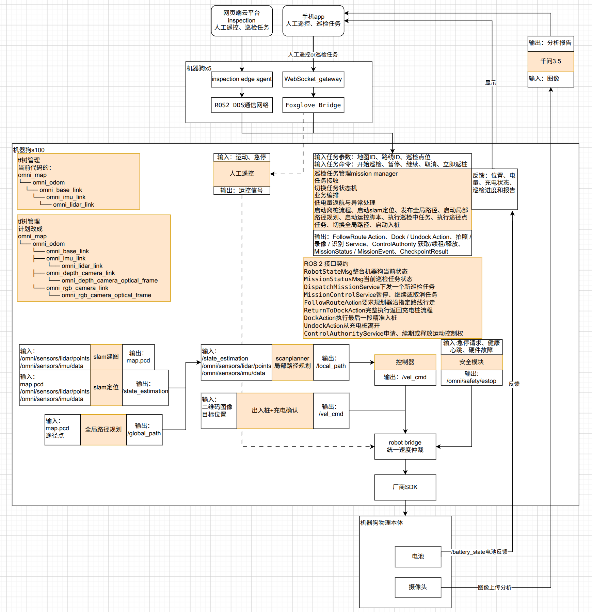

# VBot 机器狗大项目整体架构与模块输入输出分析（第二版）

> 编写日期：2026-08-28  
> 分析对象：当前本地七个工程，以及下图所示 VBot 双板机器狗整体架构。  
> 判断符号：✅ 基本合理；⚠️ 方向合理但尚未闭环；❌ 当前不成立；🎯 建议目标。

## 1. 巡检机器狗软件总体架构



这张图可以作为当前项目的整体架构图，用于说明网页平台、手机 App、X5、S100、SLAM、TF、Mission Manager、SCAN-Planner、Docking、Safety、Robot Bridge、厂商 SDK、电池、摄像头和 AI 分析之间的关系。

### 1.1 图中已经表达正确的主结构

1. 手机 App、网页平台位于机器人之外。
2. X5 负责 WebSocket Gateway 和 Foxglove Bridge，并新增了 inspection Edge Agent，已经能够表达手机与云平台两条上层入口。
3. S100 负责 SLAM、规划、Mission、Docking、Safety、Robot Bridge 和厂商 ROS 2/底盘接入。
4. Mission Manager 位于上层指令和底层能力模块之间，负责任务编排。
5. 人工遥控、SCAN-Planner、Docking 和 Safety 最终汇入 Robot Bridge。
6. Robot Bridge 再进入厂商 SDK 和物理机器狗。
7. 电池、摄像头、位置、任务进度需要反馈给手机和网页平台。
8. `omni_robot_interfaces` 被作为 ROS 2 接口契约，而不是算法节点。

## 2. 整个项目的推荐分层

结合当前图片和本地代码，整个系统可以分为七层。

| 层级 | 模块 | 核心职责 |
|---|---|---|
| 用户与平台层 | 手机 App、网页巡检平台 | 人工操作、任务创建、状态显示、报告查看 |
| 网络接入层 | X5、`omni_ws_gateway`、Foxglove Bridge | WSS 安全接入、ROS 2 远程访问、无线网络转发 |
| 云边翻译层 | inspection Edge Agent（可部署在 X5 或 S100） | MQTT/HTTPS 与本地 ROS 2 Mission 接口之间的翻译 |
| 任务编排层 | Mission Manager、Inspection Executor | 巡检状态机、路线分段、检查点动作、返航、低电策略 |
| 状态估计与自主能力层 | SLAM Manager、FAST-LIO、ICP、TF Manager、SCAN-Planner、Docking | 建图、定位、TF、路线执行、局部避障、入桩离桩 |
| 控制与安全层 | Safety Supervisor、Robot Bridge | 急停、控制权、速度仲裁、限幅、watchdog、状态汇总 |
| 硬件与厂商层 | S100 厂商 ROS 2、VBot 底盘、BMS、LiDAR、IMU、Camera | 原始传感器、运动执行、电池与硬件状态 |

`omni_robot_interfaces` 横跨任务、规划、回充、控制和 App，不属于某一个运行层。它定义这些模块之间必须共同遵守的 ROS 2 Msg、Service 和 Action。

## 3. 七个本地仓库之间的关系

| 仓库 | 主要模块 | 在图中的位置 |
|---|---|---|
| `rosdeck` | 手机 App、Mission Manager、WS Gateway、Robot Bridge、Safety、内嵌 Docking 副本 | 手机、X5、S100 任务与控制层 |
| `omni-inspection` | 网页平台、后端、MQTT、Edge Agent、视频与报告 | 网页平台，以及图中 X5 的 inspection Edge Agent |
| `omni_robot_interfaces` | RobotState、Mission、Planner、Docking、ControlAuthority 契约 | 图中 ROS 2 接口契约框 |
| `omni_slam` | SLAM Manager、FAST-LIO、ICP、地图存储、路线工具 | S100 的建图、定位、地图和路线部分 |
| `omni_tf_manager` | 传感器规范化、外参、TF、机身里程计、ready | S100 的 TF 树管理部分 |
| `SCAN-Planner` | FollowRoute、局部规划、轨迹生成、闭环控制 | S100 的 SCAN-Planner 和 Controller |
| `omni_docking` | Dock、Undock、桩配置、末端控制、充电确认 | S100 的出入桩与充电确认 |

## 4. 两条上层指令通道

### 4.1 手机 App 本地通道

正确流程是：

```text
手机 App
→ Wi-Fi
→ WSS :8765
→ X5上的 omni_ws_gateway
→ 本机 WS :8766
→ Foxglove Bridge
→ 跨板 ROS 2 DDS
→ S100上的 Mission Manager 或 Robot Bridge
```

手机发送两类完全不同的指令。

#### 人工遥控

```text
手机摇杆
→ /omni/cmd_vel/teleop
→ Robot Bridge
→ APP控制权有效时才允许通过
→ /omni/cmd_vel/final
→ VBot厂商底盘接口
```

人工遥控不进入 Mission Manager，但必须进入 Robot Bridge。

#### 巡检任务操作

```text
开始巡检
暂停
继续
取消
立即返航
```

这些命令进入 Mission Manager，由 Mission Manager 调用 Planner、Docking 和巡检服务。

### 4.2 网页云平台通道

更新后的图已经把网页平台接入 inspection Edge Agent，把手机 App 接入 WebSocket Gateway，这一层次划分比上一版准确。

推荐生产链路：

```text
网页用户
→ omni-inspection后端
→ MQTT TLS / HTTPS
→ X5或S100上的 inspection Edge Agent
→ ROS 2 DDS
→ DispatchMission / MissionControl
→ Mission Manager
```

返回方向：

```text
RobotState / MissionStatus / MissionEvent / DockStatus / BatteryState
→ Edge Agent
→ MQTT
→ 云平台后端
→ WebSocket
→ 网页控制台
```

### 4.3 图中新增的 inspection Edge Agent

新图已经增加 inspection Edge Agent。该模块的职责建议限定为：

```text
Edge Agent

输入：
云端MQTT任务与配置
RobotState / MissionStatus / BatteryState

输出：
DispatchMission / MissionControl
任务事件、遥测、报告素材上传
```

Edge Agent 只做“翻译与转发”，不应再实现自己的 patrol 状态机。

新图已将 Edge Agent 改为直接接入 ROS 2 DDS，方向正确。Edge Agent 与 Foxglove Bridge 是两条并行接入通道，不互相依赖：

```text
手机 App
→ omni_ws_gateway
→ Foxglove Bridge
→ ROS 2 DDS

云平台
→ inspection Edge Agent
→ ROS 2 DDS
→ Mission Manager
```

图中的“ROS 2 DDS 通信网络”应理解为跨 X5 与 S100 的底层通信总线，而不是一个仅部署在 X5 上的业务进程。Foxglove Bridge、Edge Agent、Mission Manager 和 Robot Bridge 都可以作为 ROS 2 节点参与同一个 DDS 通信域。

Edge Agent 放在 X5 是可以讨论的方案，但需要满足以下条件：

- X5 能运行对应 ROS 2、MQTT 和部署环境。
- X5 与 S100 的 DDS 发现、Domain ID、QoS 和防火墙配置一致。
- Edge Agent 只通过 ROS 2 读取 `/battery_state`、RobotState 和任务状态。
- 不再读取 X5 本机 `/sys/class/power_supply` 作为机器狗主电池。
- 不直接调用只存在于 S100 本机的硬件脚本或厂商服务。

如果当前 Edge Agent 仍依赖 `s100_ros2_robot_adapter`、S100 本机硬件接口或视频设备，则应继续运行在 S100，X5 只做 IP 转发。无论部署在哪块板上，业务职责都应保持不变。

## 5. ROS 2 接口契约层

图中增加 `ROS 2 接口契约` 是正确的，但应明确：它不是一个运行节点，也不会处理数据。

建议图中的框写成：

```text
omni_robot_interfaces
ROS 2 Msg / Srv / Action 契约
不运行算法，不转发数据

RobotState / MissionStatus
DispatchMission / MissionControl
FollowRoute
ReturnToDock / Dock / Undock
ControlAuthority
```

建议用虚线分别连接：

- 手机 App 或 Edge Agent。
- Mission Manager。
- SCAN-Planner。
- `omni_docking`。
- Robot Bridge。

不要画成：

```text
Mission → interfaces → Planner
```

因为实际运行数据仍然是 Mission 直接通过 ROS 2 Action 调用 Planner；interfaces 只规定双方使用什么消息格式。

### 5.1 RobotState

表示整台机器狗的统一状态，由 Robot Bridge 汇总并发布。

理论内容：

```text
当前模式
控制权所有者
定位状态
地图ID和版本
急停状态
健康状态
任务摘要
电池百分比、电压和充电状态
```

主要消费者：App、Mission Manager、Edge Agent、Safety 和诊断工具。

### 5.2 MissionStatus

表示当前巡检任务状态，由 Mission Manager 发布。

理论内容：

```text
mission_id
route_id
map_id / map_version
任务生命周期
当前阶段
进度
失败原因
```

`RobotState` 是整机仪表盘，`MissionStatus` 是任务进度单，二者不能混为一个消息。

### 5.3 DispatchMission / MissionControl

`DispatchMission` 用于下发一个新巡检任务，只返回是否成功受理，不等待整个任务完成。

`MissionControl` 用于：

```text
PAUSE
RESUME
CANCEL
```

显式“立即返航”当前由 `ReturnToDock` 表达，未来也可以统一成一种 Mission 类型。

### 5.4 FollowRoute

Mission Manager 发给 SCAN-Planner 的长时间 Action：

```text
输入：路线、地图、任务ID、速度比例
反馈：规划中、执行中、当前进度、当前位置
结果：成功、取消、定位丢失、超时、规划失败
```

### 5.5 ReturnToDock / Dock / Undock

- `ReturnToDock`：Mission Manager 编排的完整返航流程。
- `Dock`：已经到达桩前等待点后的末端入桩和充电确认。
- `Undock`：任务开始前离开充电桩。

### 5.6 ControlAuthority

表示谁拥有机器狗运动控制权：

```text
APP
MISSION
DOCKING
NONE
```

支持申请、续期和释放。该服务的提供者应该是 Robot Bridge，而不是网络 `omni_ws_gateway`。

当前本地接口已经定义，但尚未找到强类型 `/omni/control/authority` 服务端，这是 P0 集成断点。

## 6. Mission Manager

Mission Manager 的准确定位是：

> 接收一个高级任务目标，根据整机状态和安全条件，按顺序调用离桩、导航、检查点、返航、入桩等能力，并持续发布任务状态。

### 6.1 理论输入

| 输入 | 内容 |
|---|---|
| 新任务 | map_id、map_version、route_id、checkpoint_ids、request_id |
| 控制命令 | 开始、暂停、继续、取消、立即返航 |
| 整机状态 | RobotState、BatteryState、急停、控制权、健康状态 |
| 定位状态 | SLAM localized、TF ready、当前地图和版本 |
| 路线资产 | nav_msgs/Path、路线元数据、检查点配置 |
| 能力反馈 | FollowRoute、Dock、Undock、拍照、录像、识别结果 |

### 6.2 理论输出

```text
FollowRoute Action
Dock / Undock Action
拍照 / 录像 / 识别 Service
ControlAuthority 获取、续租、释放
MissionStatus
MissionEvent
CheckpointResult
SQLite任务与事件记录
```

### 6.3 图中需要废弃的旧 Mission 输出

图中 Mission 框上半部分仍写着：

```text
启动离桩流程
启动SLAM定位
发布全局路径
启动局部路径规划
启动远控脚本
```

这组文字不建议保留到下一次架构图中。

- Mission 应调用 `Undock`，不是自己控制离桩电机。
- Mission 应检查或请求 SLAM 定位能力，不直接管理 FAST-LIO 进程。
- Mission 把路线放入 FollowRoute goal，不直接充当路径发布器。
- SCAN-Planner 接收到 Action 后自己启动规划执行流程。
- 人工遥控属于 App → Robot Bridge，不属于 Mission。

### 6.4 当前实现中合理的能力

当前 [Mission Manager](./rosdeck/robot/omni_mission_manager/README.md) 已包含：

- 单任务状态机。
- Dispatch、Pause、Resume、Cancel。
- SQLite 持久化和幂等键。
- FollowRoute 客户端。
- 路线分段和检查点动作。
- MissionStatus、MissionEvent、CheckpointResult。
- 低电 ReturnToDock。
- Dock Action 客户端。
- 重启后把未结束任务标记为 INTERRUPTED。

### 6.5 当前未闭环的问题

1. `/omni/control/authority` 没有服务端。
2. Mission 尚未调用 `Undock`。
3. 任务完成后的自动返航触发尚未接通。
4. ReturnToDock 没有完全并入普通 MissionStatus 状态模型。
5. 返航仍使用 `/state_estimation_global`，目标应迁移到 TF Manager 的规范机身位姿。
6. 固定 20% 低电返航没有考虑回桩距离和电池真实性。

### 6.6 建议的任务阶段

保持简单即可：

```text
IDLE
→ PRECHECK
→ UNDOCKING（如果在桩上）
→ NAVIGATING
→ INSPECTING
→ NAVIGATING
→ RETURNING
→ DOCKING
→ VERIFYING_CHARGE
→ SUCCEEDED / FAILED
```

手机和网页只需要提供：开始、暂停、继续、取消、立即返航。

## 7. TF Manager 与 TF 树

### 7.1 当前 VBot 候选树

```text
omni_map
└── omni_odom
    └── omni_base_link
        └── omni_imu_link
            └── omni_lidar_link
```

树的父子关系是合理候选，但当前 [VBot TF profile](./omni_tf_manager/config/omni_vbot_dog.yaml) 配置为：

```text
mode = shadow
lidar alias_verified = false
imu alias_verified = false
```

所以这棵树不能标注为“当前运行中的真实 TF 树”，更准确的标题是：

```text
当前代码中的VBot候选TF树
shadow，待实机header和外参确认
```

### 7.2 计划树

相机加入后的目标结构可以是：

```text
omni_map
└── omni_odom
    └── omni_base_link
        ├── omni_imu_link
        │   └── omni_lidar_link
        ├── omni_depth_camera_link
        │   └── omni_depth_camera_optical_frame
        └── omni_rgb_camera_link
            └── omni_rgb_camera_optical_frame
```

但必须先确认：

- 相机型号和驱动话题。
- 原始 `header.frame_id`。
- 相机安装位置和完整 6DoF 外参。
- optical frame 是否遵守 ROS 相机坐标约定。
- 是否已有厂商节点发布相同 child frame。

腿和关节 TF 应由 URDF、`joint_states` 和 `robot_state_publisher` 管理，不应由 TF Manager 重复发布。

### 7.3 TF Manager 输入

```text
/state_estimation
/icp_result
/omni/slam/status
LiDAR/IMU原始header
版本化标定profile
```

### 7.4 TF Manager 输出

```text
/tf
/tf_static
/omni/tf_manager/body_odom
/omni/tf_manager/body_odom_global
/omni/tf_manager/ready
/diagnostics
/omni/sensors/lidar/points
/omni/sensors/imu/data
```

只有完成实机验证并切换到 authority 后，才能把它作为全系统唯一 TF 权威。

## 8. SLAM 建图、定位与 SLAM Manager

图中把建图和定位分开是合理的，但建议在两者上方补充 `omni_slam_manager`。

### 8.1 SLAM Manager

负责：

```text
启动/停止建图
保存地图
启动/停止定位
监控FAST-LIO和ICP子进程
维护SlamStatus
管理地图版本
```

稳定接口参见 [omni_slam README](./omni_slam/README.md)：

```text
/omni/slam/start_mapping
/omni/slam/stop_mapping
/omni/slam/save_map
/omni/slam/start_localization
/omni/slam/stop_localization
/omni/slam/status
```

### 8.2 建图输入输出

图中输入改成规范话题是正确方向：

```text
输入：
/omni/sensors/lidar/points
/omni/sensors/imu/data

输出：
/state_estimation
/cloud_registered_global
/omni/slam/status
版本化地图资产
```

不建议只写 `map.pcd`。产品地图应是：

```text
map_id
└── versions
    └── vXXXXXX
        ├── map.pcd
        └── manifest.json
```

manifest 至少记录地图哈希、创建时间、坐标系和 calibration_hash。

### 8.3 定位输入输出

```text
输入：
map_id / map_version
版本化map.pcd
/omni/sensors/lidar/points
/omni/sensors/imu/data
初始位姿

输出：
/state_estimation
/icp_result
/cloud_registered_global
/omni/slam/status
```

SLAM 输出位姿估计和 ICP 配准结果，规范 TF 由 TF Manager 生成。

## 9. 路线资产与图中的“全局路径规划”

当前图中的“全局路径规划”名称容易造成误解。

当前代码主要支持：

- 录制机器狗走过的全局机身路线。
- 从 waypoints 或 RViz goal 构建参考路线。
- Mission Manager 从 routes_dir 读取路线。
- 把 `nav_msgs/Path` 交给 FollowRoute。

它目前不是一个读取三维 PCD 后自动执行 A*、Dijkstra 或拓扑搜索的完整全局规划器。

因此建议下一版图改名为：

```text
路线资产 / 全局参考路径

输入：
录制轨迹、waypoints
map_id、map_version

输出：
route_id
nav_msgs/Path（omni_map）
```

地图、路线和充电桩配置必须绑定：

```text
robot_id
map_id
map_version
calibration_version
route_id
dock_id
```

## 10. SCAN-Planner 与 Controller

图中把 SCAN-Planner 和 Controller 分开，适合算法内部流程图；在系统级架构中也可以合并为一个 SCAN-Planner 能力模块。

### 10.1 推荐输入

```text
FollowRoute(nav_msgs/Path)
/omni/tf_manager/body_odom_global
/cloud_registered_global
/omni/tf_manager/ready
```

图中目前写的 `/state_estimation + 规范LiDAR/IMU` 不适合作为 Planner 的最终外部接口。

- `/state_estimation` 是 IMU tracking frame 的估计，不一定是机身中心。
- Planner 不应重新处理原始 LiDAR/IMU 融合。
- Planner 应使用 SLAM 已经注册到世界坐标系的点云。

### 10.2 推荐输出

```text
/planning/local_path       调试和显示
/scan_planner/cmd_vel      导航速度候选
FollowRoute feedback
FollowRoute result
```

Controller 的输出不建议写通用 `/vel_cmd`，否则容易和厂商旧接口混淆。

### 10.3 当前实现判断

✅ 当前 [SCAN-Planner](./SCAN-Planner/README.md) 已提供 `/omni/navigation/follow_route` Action。

✅ Planner 内部已有局部规划、B-spline 和闭环 Controller。

⚠️ `require_tf_ready` 默认仍是 false，生产部署应设为 true。

⚠️ `/scan_planner/cmd_vel` 必须经过 Robot Bridge，不能直接进入厂商底盘。

## 11. 出入桩与充电确认

### 11.1 当前正确输入

```text
Dock / Undock Action
/omni/robot_state
/omni/tf_manager/body_odom_global
/battery_state
桩位配置
DOCKING控制权
```

### 11.2 当前正确输出

```text
/omni/cmd_vel/docking
/omni/docking/status
Dock / Undock feedback和result
VerifyCharge结果
```

### 11.3 图中“二维图像”需要修改

当前 [omni_docking](./omni_docking/README.md) 不订阅二维图像。它主要使用全局位姿和桩配置做位姿伺服。

若将来增加视觉精确入桩，正确分层应是：

```text
Camera
→ 充电桩感知模块
→ 相对桩位姿 + 置信度 + 时间戳
→ omni_docking
→ /omni/cmd_vel/docking
```

Docking 不应直接承担图像识别。

### 11.4 两份 Docking 源码

当前同时存在：

- 独立仓库：`./omni_docking`
- rosdeck 内嵌副本：`./rosdeck/robot/omni_docking`

目前核心 Python 代码和测试相同，但长期维护会发生漂移。建议独立仓库作为唯一源码，rosdeck 构建时以依赖形式引入。

## 12. Safety Supervisor

图中现在把安全模块输出改成 `/omni/safety/estop`，方向正确。

### 12.1 输入

```text
人工急停请求
健康心跳
硬件故障
后续GPIO/PLC硬件急停
```

### 12.2 输出

```text
/omni/safety/estop
/omni/safety/supervisor_status
arm / latch相关服务
```

Safety 不负责“低电返航”。低电返航属于 Mission Manager；Safety 只负责立即停车、锁存和禁止继续运动。

### 12.3 当前问题

VBot 生产启动脚本默认不启动 Safety Supervisor，同时 VBot 速度仲裁关闭。因此当前 Safety 还不能覆盖旧 `/vel_cmd` 运动路径。

## 13. Robot Bridge

图中 `robot bridge 统一速度仲裁` 的位置正确。它应该是所有软件运动命令进入厂商底盘之前的唯一控制边界。

### 13.1 输入

```text
/omni/cmd_vel/teleop
/scan_planner/cmd_vel
/omni/cmd_vel/docking
/omni/safety/estop
ControlAuthority请求
厂商/BMS telemetry
SlamStatus / MissionStatus
```

### 13.2 输出

```text
/omni/cmd_vel/final
厂商运行模式和姿态命令
/battery_state
/omni/robot_state
/diagnostics
仲裁状态
```

### 13.3 正确仲裁关系

| 控制权 | 可以通过的速度源 |
|---|---|
| APP | `/omni/cmd_vel/teleop` |
| MISSION | `/scan_planner/cmd_vel` |
| DOCKING | `/omni/cmd_vel/docking` |
| NONE | 全部输出零 |
| ESTOP | 无条件输出零并锁存 |

### 13.4 当前 VBot 真实状态

当前 VBot 配置仍是：

```text
control.enabled = false
cmd_vel_arbiter.enabled = false
```

所以图中的统一仲裁是必须实现的目标，不是当前已经闭环的事实。

当前还需要：

1. Robot Bridge 实现强类型 `/omni/control/authority` 服务端。
2. 增加 `/omni/cmd_vel/final → VBot厂商运动接口` Adapter。
3. 启用 VBot 三路速度仲裁。
4. 删除 App、Planner 和其他节点直发旧 `/vel_cmd` 的路径。
5. 默认启用 Safety Supervisor。

## 14. 厂商 SDK、物理机器狗和传感器

### 14.1 厂商运动接口输入

```text
最终速度
站立/趴下
运行模式切换
急停和恢复条件
```

### 14.2 厂商与硬件输出

```text
底盘连接状态
运行模式和姿态
故障码
关节状态
机器狗主电池BMS数据
LiDAR / IMU / Camera原始数据
```

当前 VBot Adapter 已接入部分厂商 ROS 2 Service，例如运行模式和 LowlevelAction，但没有确认权威的底盘运动与 BMS 遥测接口。

## 15. 电池、电压、电流与自动返航

### 15.1 正确数据链路

```text
机器狗主电池BMS
→ 厂商驱动或BMS Adapter
→ Robot Bridge校验、单位转换、freshness判断
→ /battery_state
→ /omni/robot_state
```

然后分三路：

```text
→ Mission Manager：低电策略和自动返航
→ Foxglove Bridge：手机显示
→ Edge Agent：云平台遥测
```

### 15.2 逻辑归属

| 功能 | 应放置位置 |
|---|---|
| SOC、电压、电流、温度采集 | BMS/厂商驱动 |
| 单位转换、过期判断、数据归一化 | Robot Bridge |
| 是否允许开始新任务 | Mission Manager |
| 何时自动返航 | Mission Manager |
| 是否已经开始充电 | omni_docking |
| 手机和网页显示 | App、Edge Agent、云平台 |
| 硬件欠压关机 | BMS和底盘控制器 |

### 15.3 当前风险

- VBot Bridge 没有确认权威底盘电池遥测。
- `/sys/class/power_supply` 可能表示 S100 板载供电，而不是机器狗主电池。
- Edge Agent 读取失败时可能把 unknown 上报成 0%。
- Mission 当前固定 20% 返航，且只在电量有效时触发。

### 15.4 初始能量策略建议

在完成实机续航标定前，可以采用保守的第一版：

```text
低于40%：拒绝新的长时间巡检
低于30%：自动返航
低于12%～15%：critical，停止非必要巡检动作
```

这些不是固定行业标准。后续应根据回桩距离、速度、坡度、温度和电池老化计算动态返航余量。

## 16. 摄像头、AI 分析与巡检报告

图中摄像头直接把图像送给“千问 3.5”，再输出分析报告，适合表达概念，但工程边界还需细分。

### 16.1 推荐流程

```text
Camera驱动
→ Inspection Executor / Capture Service
→ 图片或视频文件
→ Edge Agent上传
→ AI分析服务
→ 结构化缺陷结果
→ 云平台报告服务
→ 巡检分析报告
→ 手机和网页显示
```

### 16.2 AI 分析输入

```text
图片/视频
checkpoint_id
mission_id
拍摄时间
机器人位姿
设备和检测对象信息
模型版本
```

### 16.3 AI 分析输出

```text
缺陷类型
置信度
严重程度
目标框或区域
文字描述
证据文件URI
是否需要人工复核
```

建议图中把“千问 3.5”改为：

```text
AI巡检分析服务
模型可替换
```

模型不应成为整个架构的固定依赖。最终报告通常由云平台汇总多个检查点和多次分析结果生成。

## 17. 状态与反馈链路

图中右侧“位置、电量、充电状态、巡检进度和报告”方向正确，但建议拆成标准状态源。

| 状态 | 生产者 | 消费者 |
|---|---|---|
| RobotState | Robot Bridge | App、Mission、Edge Agent |
| MissionStatus | Mission Manager | App、Robot Bridge、Edge Agent |
| MissionEvent | Mission Manager | App、云平台、诊断 |
| CheckpointResult | Mission Manager/Inspection Executor | App、云平台报告 |
| SlamStatus | SLAM Manager | TF Manager、Robot Bridge、Mission |
| TF ready | TF Manager | Planner、Mission、Safety/Bridge |
| DockStatus | omni_docking | Mission、App、Edge Agent |
| BatteryState | Robot Bridge/BMS Adapter | Mission、Docking、App、Edge Agent |
| Diagnostics | 各机器人模块 | 运维和故障诊断 |

手机通道通过 Foxglove/WSS 接收这些状态；云平台通过 Edge Agent/MQTT 接收。不要让每个算法节点分别维护自己的手机协议。

## 18. X5 与 S100 的程序部署建议

### X5

```text
Wi-Fi/AP和网络路由
omni_ws_gateway
foxglove_bridge
证书、用户、RBAC和审计
可选：inspection Edge Agent（仅云边协议翻译）
```

如果 Edge Agent 部署在 X5，它必须直接通过 ROS 2 DDS 与 S100 上的 Mission Manager、Robot Bridge 等节点通信。新图已经按这一关系表达。

X5 不运行：

```text
Mission Manager
SLAM
TF Manager
SCAN-Planner
Docking
Safety
Robot Bridge
```

### S100

```text
厂商ROS 2和底盘接入
Mission Manager
SLAM Manager / FAST-LIO / ICP
TF Manager
SCAN-Planner / Controller
omni_docking
Safety Supervisor
Robot Bridge
相机采集和巡检执行服务
```

如果现有 Edge Agent 仍依赖 S100 本机硬件、`s100_ros2_robot_adapter`、本地摄像头或厂商 Service，则 Edge Agent 也应放在 S100，而不是 X5。

X5 和 S100 通过内部有线网络和 ROS 2 DDS 通信。S100 内部模块之间不需要绕经 Foxglove Bridge。Edge Agent 的部署位置可以二选一，但同一台机器狗只应运行一个任务 Edge Agent 实例。

## 19. 当前图能否直接作为对外架构图

结论：可以作为第二版总体架构底图，但建议在图标题或图注中增加一句：

```text
实线表示当前设计主链路；虚线表示待完成适配或控制候选链路。
```

并在下一次修改图片时优先完成以下调整：

1. 保留 `inspection Edge Agent → ROS 2 DDS` 链路，并将 DDS 标注为“跨 X5/S100 的 ROS 2 DDS 通信网络”。
2. 删除 Mission 框中的旧输出说明，只保留强类型能力调用。
3. 把 ROS 2 接口契约框改名为 `omni_robot_interfaces`，并用虚线连接各消费者。
4. 增加 `omni_tf_manager` 和 `omni_slam_manager` 模块名称。
5. 把全局路径规划改为路线资产/全局参考路径。
6. 修改 SCAN-Planner 的输入和 Controller 输出话题。
7. 修改 Docking 的二维图像输入。
8. 三路速度分别标注后汇入 Robot Bridge。
9. 电池先进入 Bridge，再向 Mission、App、Edge Agent分发。
10. 将千问模块泛化为 AI 分析服务，将最终报告放在云平台。

## 20. 接下来最优先的工程工作

### 优化 1：闭合运动控制和安全链路

- Robot Bridge 实现 `/omni/control/authority` 服务端。
- Mission、Docking、App 使用统一控制权协议。
- VBot 启用 teleop/navigation/docking 三路速度仲裁。
- 建立唯一 `/omni/cmd_vel/final` 到厂商底盘的出口。
- 默认启动 Safety Supervisor。
- 移除旧 `/vel_cmd` 直达路径。

### 优化 2：闭合 TF、SLAM 和 Planner 链路

- 实机抓取 LiDAR/IMU header 和 rosbag。
- 核对坐标轴、时间戳和完整外参。
- TF Manager 从 shadow 切换到 authority。
- SLAM 只消费规范传感器并输出位姿/配准结果。
- Planner 使用 body_odom_global、cloud_registered_global、Path 和 TF ready。
- Mission、Docking 使用统一机身全局位姿。

### 优化 3：闭合完整巡检、能量和报告链路

- Mission 接入 Undock、任务完成返航和统一 ReturnToDock 状态。
- Edge Agent 改成纯云边翻译层。
- 接入权威机器狗 BMS。
- 建立低电拒绝新任务、自动返航和 critical 策略。
- 打通拍照、录像、AI结构化结果和云端报告。

## 21. 最终判断

以更新后的截图作为第二版整体架构是可以的。它已经把手机与云平台入口分开，并补充了 inspection Edge Agent；同时还包含双板分工、Mission Manager、ROS 2 接口契约、SLAM、规划、Docking、Safety、Robot Bridge、硬件和 AI 分析。

本次图片已经修正 Edge Agent 与 Foxglove Bridge 的关系。两者最终通过同一个跨板 ROS 2 DDS 通信域与 S100 节点交互；图中的 DDS 框表示通信网络，不是单独的业务服务。

需要强调的是，这张图应被理解为“当前项目的总体设计和集成目标”，而不是所有箭头已经在 VBot 实机上完成验证。当前最关键的五个断点仍然是：

1. 强类型 ControlAuthority 服务端缺失。
2. VBot 统一速度仲裁尚未启用。
3. VBot Safety 尚未覆盖真实运动出口。
4. TF Manager 仍为 shadow。
5. 权威机器狗 BMS 数据源尚未确认。

这五项完成后，自动巡检、暂停继续、低电返航、自动入桩和手机/网页状态反馈才形成真正可验证的闭环。
