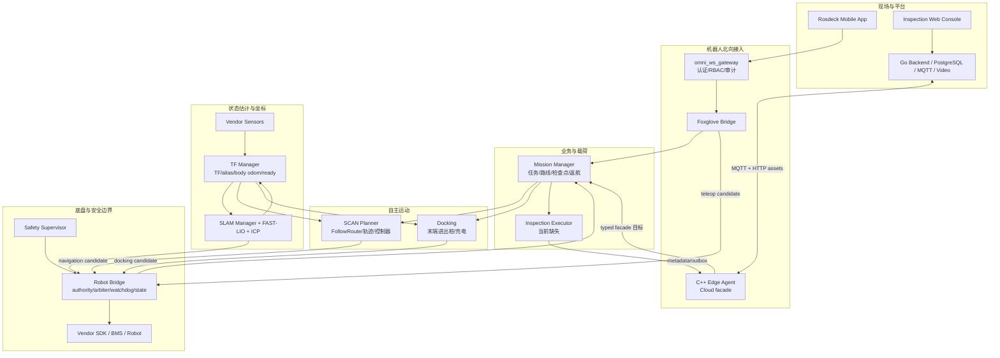
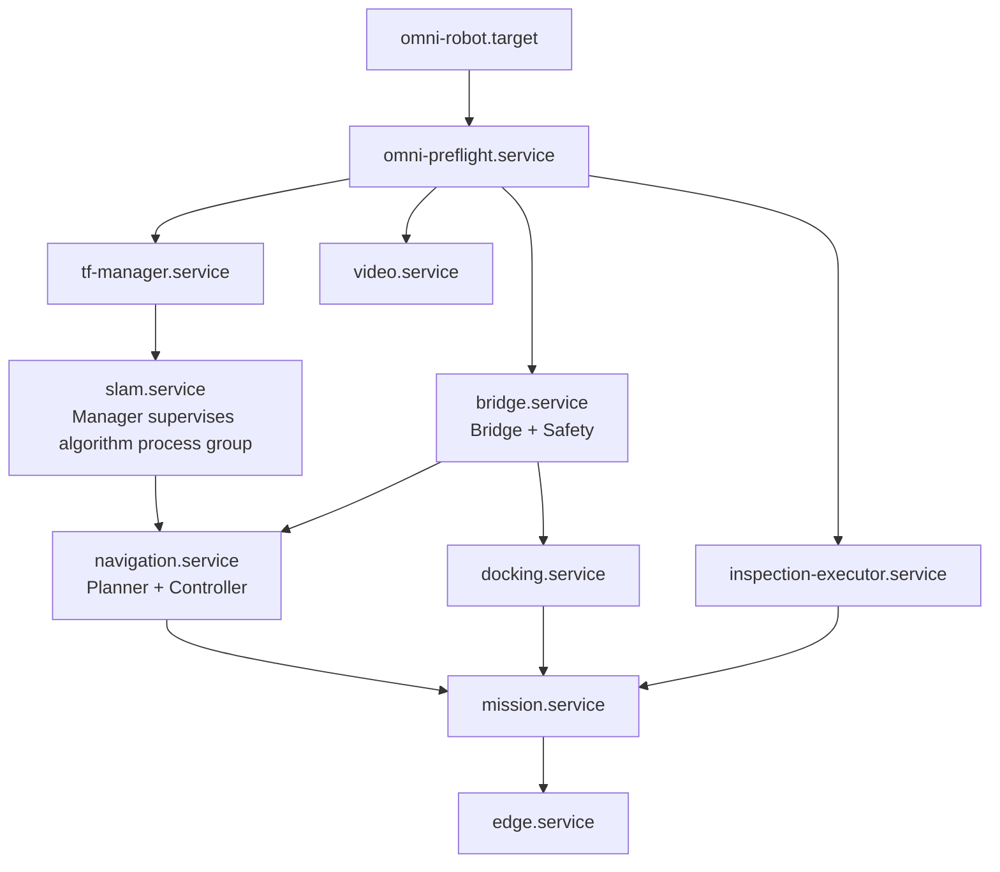
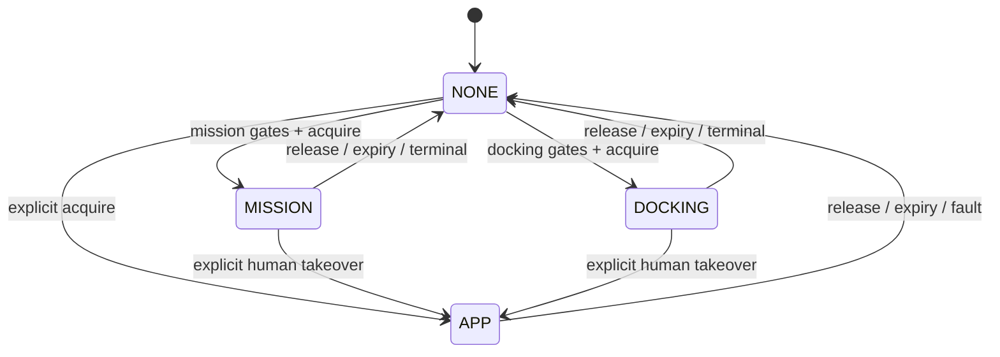
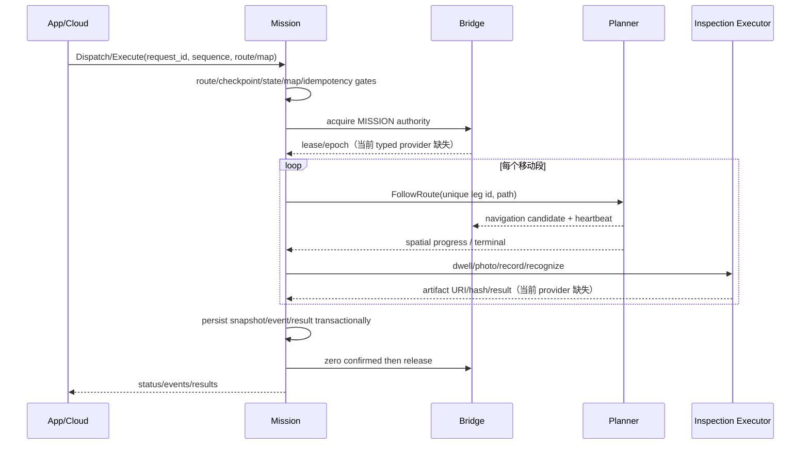
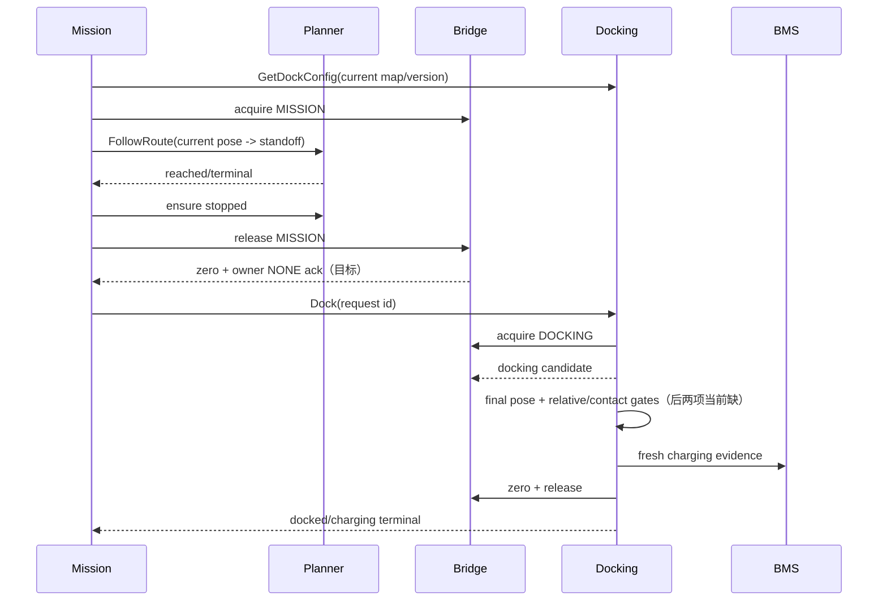

# Omni 巡检机器人整机架构

> 文档状态：源码审计版 v1.0
>
> 审计基线：2026-08-28 当前工作区
>
> 适用平台：Matrix/x86、NVIDIA Orin、RDK S100、真实机器狗
>
> 所有者：`omni_navi` 集成仓库
> 重要结论：当前是“模块能力基本成形、整机产品链尚未闭环”，不能宣称已经具备可放行的自动巡检/回充整机。

## 1. 文档导航

本页回答整机层问题：模块边界、权威关系、启动/关闭、关键业务流、安全不变量、故障域和放行条件。实现细节拆到以下审计文档：

- [机器人运行时模块详解](MODULES_ROBOT_RUNTIME.md)：Interfaces、TF、SLAM、Planner、Bridge、Docking、Mission；
- [平台、边缘、视频与客户端模块详解](MODULES_PLATFORM_CLIENTS.md)：Inspection Cloud/Edge/Web/Video、Rosdeck、VBot IDL、Navi 集成；
- [跨模块接口矩阵](INTERFACE_MATRIX.md)：Topic、Service、Action、TF、QoS、资产和北向协议；
- [全仓库源码审计清单](REPOSITORY_AUDIT.md)：11 个仓库、39 个 ROS 包、提交版本、入口和测试证据；
- [仓库目录](REPOSITORIES.md) 与 [联合构建](BUILD.md)：远端所有权和导入/构建方法；
- [近期集成交付](INTEGRATION_TODO.md)：阶段计划，不能替代本页的架构事实。

后文统一使用：

- **当前**：本次实际读到的源码/配置行为；
- **目标**：产品架构要求，但代码未必实现；
- **缺口**：会阻断当前链路或放行的差异；
- **遗留**：迁移期兼容入口，不允许新模块继续依赖。

## 2. 范围与非目标

### 2.1 范围

本架构覆盖：

- 供应商传感器、LiDAR/IMU 状态估计、ICP 重定位和地图资产；
- canonical TF、外参、frame alias、标准 body odom 和 ready；
- 三维局部占据图、路线跟随、重规划、轨迹验收和闭环控制；
- 厂商 SDK Bridge、速度仲裁、控制权、E-stop、BMS 和 RobotState；
- 任务、路线、检查点、证据、返航、进桩、出桩和充电确认；
- 机器人 Edge、Cloud Backend、Web Console、视频链和移动 App；
- manifest、联合构建、目标板部署、A/B 更新、整机 bringup 和发布质量门。

### 2.2 非目标

- 不增加第二个任务管理器、第二个导航业务入口或第二个底盘控制权状态机；
- 不把每个状态、地图或诊断能力拆成独立“Manager”进程；
- 不要求高频算法控制面都从 Python 重写，重写只由实时性/可靠性证据决定；
- 不把 Cloud、Web、MQTT 或视频可用性作为本地停车条件；
- 不将供应商 IDL 中存在的接口自动视为产品已实现能力；
- 不将单元测试通过等价为 ROS 图、目标板或真机放行。

## 3. 当前基线结论

### 3.1 已有能力

- 产品跨仓 IDL 已覆盖 RobotState、Mission、Docking、Route、Authority、巡检载荷和 ReturnToDock；
- TF Manager 已实现 profile 驱动的完整 6DoF 外参、受管 TF、sensor alias 和 body odom；
- SLAM 已有 FAST-LIO、ICP、子进程监督、状态 heartbeat 和不可变版本地图存储；
- Planner 已有 3D 概率栅格、A*/B-spline 优化、终验、FollowRoute、heartbeat identity 和闭环控制；
- Bridge 已有 Zsi/VBot adapter、单 SDK owner、三源速度仲裁、E-stop、BMS、RobotState 和 A/B 发布；
- Mission/Docking 的纯行为层、资产解析、幂等、检查点和返航逻辑较完整；
- Inspection Cloud 已有业务后端、数据库、MQTT、Web、视频和部署体系；
- Rosdeck 已有现场 App、teleop 安全检查、任务 UI 和认证 WSS gateway。

### 3.2 为什么仍不是完整整机

以下不是“以后优化”，而是当前真实断链：

1. Mission 请求 `/omni/control/authority`，Bridge 没有 typed provider；
2. Mission ROS Action/Future 接线存在 rclpy API 错误；
3. Docking cancel 检查把 rclpy 属性当函数调用；
4. photo/record/recognize 只有 IDL/client，没有产品 provider；
5. Edge S100 adapter 仍可直接发厂商 `/vel_cmd`、调用厂商姿态/模式服务；
6. Edge map activate 只缓存 identity，不安装地图、不启动定位、不等待 TF ready；
7. Rosdeck 实际 Foxglove binary frame 与 WSS Gateway 的 CBOR policy 解析不匹配；
8. TF ready 和 RobotState motion authorization 没有完整纳入 SLAM initialized/state/freshness；
9. Mission/Docking 仍默认 `/state_estimation_global` 与 `lio_map`，canonical 迁移未完成；
10. `omni_navi` 没有完整 bringup/preflight/systemd target；Bridge 的 product bringup 只启动 Bridge/Safety 和可选外部 OpenNav Docking。

因此准确表述是：**各模块可以独立构建/测试一部分能力，但当前工作区没有一条经过部署接线和节点级验证的“定位→巡检→证据→返航→回充”完整产品路径。**

## 4. 架构原则和不可破坏的不变量

1. `omni_robot_bridge` 是唯一厂商 SDK owner。
2. Bridge 是唯一最终速度出口；Planner、Docking、App 只产生候选速度。
3. `omni_tf_manager` 是受管 TF child 的唯一 authority；SLAM 不发布这些 TF。
4. Mission 只做业务编排，不计算局部轨迹、不发布速度、不访问 SDK。
5. 控制权不等于运动许可；有效 lease 仍可因 E-stop、定位、TF、来源或 freshness 输出零。
6. 所有超时、未知枚举、NaN、frame 错配、publisher 冲突和进程 epoch 变化都 fail-closed。
7. Cloud/App/Edge 的任务和回充请求进入同一 Mission/Docking/Bridge 权威链。
8. 旧 command、旧轨迹、旧 lease heartbeat 在重连或重启后不得重放。
9. Map、Route、Dock、Calibration、Evidence 和 BOM 必须带身份/version/hash，不能只靠文件名。
10. 进程 alive、Action accepted、pose reached、UI 显示 ready 都不等于业务成功；成功必须由对应 owner 的终态和证据定义。

## 5. 逻辑架构



图中 Edge→Mission 和 Inspection Executor 是目标产品路径；当前 Edge 仍有直接控制旁路，Executor 尚未存在。

## 6. 仓库、进程与唯一职责

| 仓库 | 正式进程/节点 | 语言 | 唯一职责 | 当前成熟度 |
| --- | --- | --- | --- | --- |
| `omni_robot_interfaces` | 无 | ROS IDL | 跨仓产品合同 | 接口完整；SLAM 类型仍分散 |
| `omni_tf_manager` | `/omni_tf_manager` | C++ | TF/外参/alias/body odom/ready | 实现较完整；ready 需加强 |
| `omni_slam` | Manager、FAST-LIO、ICP | Python+C++ | 建图/定位/地图版本/SLAM 状态 | 模块完整；整机 QoS/目标板证据不足 |
| `omni_planner` | Planner、Controller、可选 route publisher | C++ | FollowRoute、局部规划、轨迹、navigation candidate | 实现较完整；接口名/整机 gate 待收敛 |
| `omni_robot_bridge` | Bridge、Safety Supervisor | C++ | SDK、authority、arbiter、安全、BMS、RobotState | 核心完整；typed authority 缺失 |
| `omni_docking` | `/omni_docking` | Python | 末端 Dock/Undock、配置、充电判断 | 行为原型；ROS bug/真机感知缺 |
| `omni_mission_manager` | `/omni_mission_manager` | Python | 任务、路线、检查点、SQLite、返航编排 | 行为原型；ROS wiring 阻塞 |
| `omni-inspection` | Edge、Backend、Web、Video；Executor 目标 | C++/Go/TS/Python | Cloud/Edge/载荷/媒体 | 平台面丰富；机器人控制边界未收敛 |
| `rosdeck` | Mobile App、`omni_ws_gateway` | TS/Native/Python | 现场 App、WSS 认证代理 | UI/安全流程已有；binary proxy 风险 |
| `vbot_ros2_msgs` | 无 | ROS IDL | VITA 上游合同 | 纯依赖，非功能实现 |
| `omni_navi` | 当前无业务进程 | shell/Python/docs | manifest、BOM、联合构建、架构、bringup 目标 | 完整 bringup 尚缺 |

详细到 39 个 ROS 包的目录见 [REPOSITORY_AUDIT.md](REPOSITORY_AUDIT.md)。

## 7. 运行与部署拓扑

### 7.1 机器人上的目标故障域

不要求一个 launch 把所有节点变成一个 OS 进程。安全相关组件应保留可观察的故障域：



箭头代表启动依赖，不代表 readiness。服务可以先 alive，但前置不满足时必须拒绝动作/输出零。

### 7.2 当前实际部署

- Bridge 仓已有 systemd、运行锁、资源约束、critical-child shutdown、A/B release/current/previous 和 health rollback；
- `product_bringup.launch.py` 只包含 Bridge、Safety、可选 OpenNav Docking；
- Mission 有独立 unit，但未被完整机器人 target 统一编排；
- SLAM/Planner 主要由各仓脚本/launch 单独启动；
- Edge/video/cloud 有各自 systemd/Compose；
- 没有一个 profile 同时验证所有 Topic remap、TF authority、地图/路线/Dock/标定和关闭顺序。

### 7.3 为什么不新增 System Manager

- SLAM Manager 已管理 SLAM 子进程和状态；
- Mission 已管理业务状态；
- Bridge 已管理底盘和安全；
- OS 进程 restart/ordering 由 systemd 擅长处理；
- `omni_robot_bringup` 只应组合 profile、launch、preflight、systemd target、BOM 和 smoke test，不复制业务状态机。

## 8. TF 与状态估计契约

### 8.1 Canonical TF 树

```text
omni_map
└── omni_odom
    └── omni_base_link
        ├── omni_imu_link
        │   └── omni_lidar_link
        ├── omni_depth_camera_link
        │   └── omni_depth_camera_optical_frame
        └── omni_rgb_camera_link
            └── omni_rgb_camera_optical_frame
```

| TF 边 | 唯一 owner | 来源 |
| --- | --- | --- |
| `omni_map→omni_odom` | TF Manager | mapping identity；localization ICP alignment |
| `omni_odom→omni_base_link` | TF Manager | FAST-LIO tracking pose + base extrinsic |
| base/sensor fixed edges | TF Manager profile | 已审核 6DoF 标定 |
| 腿/关节运动边 | `robot_state_publisher` | URDF + joint state，不覆盖上述 child |

FAST-LIO 必须关闭 TF 发布。变换公式和输入校验见 [机器人运行时模块详解](MODULES_ROBOT_RUNTIME.md#32-输入计算和输出)。

### 8.2 Sensor alias

TF Manager 的 `identity_frame_alias` 只改 metadata，不变换点云/IMU 数值。只有原始消息本来就在 canonical physical frame 的轴和原点上时才允许；否则必须真实变换数据。Authority profile 拒绝未验证 alias。

### 8.3 Profile 现状

- Matrix profile 由模型/config validator 对齐，适合 authority；
- generic dog/`omni_dog` 的真实 Topic/header/外参仍需真机审核；
- `omni_vbot_dog.yaml` 当前源码实际设置为 authority，而同仓 README 仍写 shadow，属于文档漂移；
- 部署必须记录最终 profile 文件 SHA，不能只记录 profile 名。

### 8.4 正确 ready 语义

目标：

```text
tf_ready =
  profile_is_authority
  && slam_status_fresh
  && slam_status.initialized
  && mode_state_pair_allowed
  && sensor_odom_fresh
  && frames_and_quaternions_valid
  && jumps_within_limits
  && (mapping || accepted_fresh_map_alignment)
```

`DEGRADED`、`LOST`、`STOPPING`、`ERROR`、未知枚举、shadow、status timeout 全部为 false。当前实现还没有完整执行 `initialized/state` 条件。

## 9. 控制权、运动许可与最终速度

### 9.1 权威状态机



APP 可以显式人工抢占；MISSION 和 DOCKING 之间不直接抢占，必须零速确认后交接。当前 String lease 默认 5 s，通过 client ID 前缀推断 owner；typed service 仍缺 provider。

### 9.2 最终运动许可

目标 Bridge 每周期计算：

```text
motion_allowed =
  adapter_connected
  && safety_supervisor_armed
  && safety_heartbeat_fresh
  && !estop_latched
  && lease_valid
  && source_matches_owner
  && source_command_fresh
  && command_is_finite_and_within_limits
  && publisher_cardinality_valid
  && robot_mode_allows_motion
  && (owner == APP || (slam_localized_fresh && tf_ready))
  && (owner != DOCKING || docking_safety_ready)
```

当前 `RobotState.motion_authorized` 仅约等于 `!estop && authority != NONE`，不能被消费者当作上述真值。

### 9.3 速度管线

| Owner | Candidate | 当前类型/Topic | Watchdog 后进入 |
| --- | --- | --- | --- |
| APP | teleop | TwistStamped `/omni/cmd_vel/teleop` | Bridge arbiter |
| MISSION | navigation | Twist `/scan_planner/cmd_vel` | Bridge arbiter |
| DOCKING | docking | Twist `/omni/cmd_vel/docking` | Bridge arbiter |
| Bridge | final | Twist `/omni/cmd_vel/final` internal seam | Adapter/SDK |

目标将 navigation/docking 都收敛成 stamped candidate，但迁移必须同步修改 producer、Bridge、QoS 和 tests。最终 Topic/SDK 绝不能被 Edge 或 Planner 旧 bridge 同时发布。

### 9.4 E-stop 恢复

启动默认 latched/unarmed。恢复顺序必须是：安全输入恢复并保持 fresh → 显式 arm Supervisor → 显式 reset Bridge latch → 重新申请新 lease。重启不能自动恢复旧运动 epoch。

## 10. 关键业务流

### 10.1 上电到可导航

```mermaid
sequenceDiagram
    participant OS as systemd/preflight
    participant B as Bridge/Safety
    participant T as TF Manager
    participant S as SLAM Manager
    participant P as Planner
    OS->>OS: verify BOM/profile/calibration/map/disk/time
    OS->>B: start latched + zero
    OS->>T: load one authority profile
    OS->>S: StartLocalization(map id/version)
    S->>S: verify PCD/hash; start ICP + FAST-LIO group
    S-->>T: fresh SlamStatus(LOCALIZED, initialized)
    S-->>T: odom + ICP alignment
    T-->>P: canonical TF/body odom/ready
    P->>P: start but wait for fresh inputs
    OS->>B: operator arm + reset
```

任何一步失败都保持零速。当前缺少统一 preflight/launch，且 TF ready 条件偏弱。

### 10.2 建图与保存

```text
StartMapping(session)
 -> start FAST-LIO process group
 -> fresh lidar/imu/odom => MAPPING initialized
 -> SaveMap(map_id, calibration_hash)
 -> FAST-LIO /map_save
 -> staging copy + SHA256 + manifest + fsync
 -> publish immutable version
 -> atomic current symlink
 -> MAP_READY
```

Map 只有保存 Action 成功且 checksum 可复验才成为资产。Cloud 上传/激活是另一条同步路径，不得直接改 versions 内文件。

### 10.3 巡检任务



相同 `(request_id, sequence)` 重放必须返回原结果，不重复移动或采集。

### 10.4 Pause、Resume、Cancel

- Pause：请求当前 Planner leg 受控停止，等待终态，持久化 PAUSED，释放 MISSION lease；
- Resume：重新检查 RobotState/map/Planner，获取新 lease，用新 attempt identity 从剩余段继续；
- Cancel：向当前 Planner/inspection operation 转发 cancel，等待停止，持久化 CANCELED，零速后 release；
- 进程重启：活动任务标为 INTERRUPTED，不自动恢复动作。

### 10.5 Return-to-Dock



用户返航遇到活动 mission 应先取消；低电策略可以以明确原因 INTERRUPT mission。到 final pose 但未充电返回失败，不报告“回充成功”。

### 10.6 人工接管

App 显式申请 APP authority。Bridge 零速切换 owner 后才接受 teleop。Mission/Docking 收到 preempt 后写可审计终态。App/WSS 断线只让 APP lease 过期；Cloud/MQTT 断线不应影响现场 App 的有效本地 lease，也不能重放旧远程命令。

### 10.7 Cloud 地图激活

目标成功链：HTTP 上传 PCD→Backend 校验 hash/complete→MQTT activate(identity/hash)→Edge 下载到 staging→SLAM MapStore import→StartLocalization→LOCALIZED+initialized fresh→TF ready→ACK success。当前只做到 Backend 校验和 Edge 缓存 identity。

## 11. 路线、检查点、Dock 和证据

### 11.1 资产绑定

| 资产 | Owner | 必需身份 |
| --- | --- | --- |
| Map | SLAM Manager | map ID/version/checksum/frame/calibration hash |
| Route | Mission | route ID/map identity/frame/checksum/created time |
| Checkpoint plan | Mission | route identity/schema/checkpoint IDs/point indices |
| Dock | Docking | dock ID/map identity/frame/final pose/standoff/schema |
| Calibration/TF profile | TF Manager | robot model/serial/version/full 6DoF/verified aliases/checksum |
| Evidence | Inspection Executor + Mission | mission/request/checkpoint/action/time/pose/map/software/URI/hash |
| Software BOM | Navi | 每仓 SHA、toolchain/platform ABI/config hash/artifact digest/test evidence |

### 11.2 写入规则

- staging 与最终目录在同一文件系统；
- 内容写完后 fsync 文件和目录；
- 计算/验证 SHA256；
- atomic rename/symlink switch；
- immutable version 不原地修改；
- 读取时 identity/frame/hash 不匹配必须拒绝，不只 warning；
- 临时证据失败要可清理，已成功证据要通过 durable outbox 上传。

## 12. 北向平台与媒体边界

### 12.1 Cloud/Edge

- Backend 是 durable platform state owner，PostgreSQL 保存任务/告警/资产/审计，Redis 只做加速；
- MQTT command 依靠 command ID、expiry、sequence、ACK 和去重，而非只靠 QoS；
- Edge SafetyGuard 做 token/session/timestamp/sequence/limit 和约 500 ms stop；
- 最终仍必须经 Mission/Bridge，Edge guard 不是第二个 Bridge；
- production profile 必须禁止 simulation adapter 静默启用。

### 12.2 App/WSS Gateway

- App 通过 TLS WSS 到 Gateway，再经 loopback Foxglove 到 ROS；
- Gateway 负责 login、viewer/operator/admin RBAC、失败锁定和 append-only audit；
- 当前 Gateway E2E 使用自定义 CBOR policy frame，与 App 真实 Foxglove binary publish/service 不同；
- 必须做真实 App wire test 后才能放行任务和 teleop；
- 配对保存 SPKI pin 不等于客户端已强制校验，需错误证书真机测试。

### 12.3 Video

- 机器人 streamer 订阅 ROS 视频，使用有界 drop-old queue 和可选 S100 hardware transcode；
- 主路径：H.264/SRT→MediaMTX→WHEP/WebRTC；
- RTSP→MJPEG/snapshot/recording 是兼容路径；Pion/LiveKit/ffmpeg 是明确可选路径；
- 媒体失败与 Bridge/Safety 隔离，不得影响本地停车；
- 同一 profile 只选一个主媒体路径，避免重复拉流/转码。

## 13. 启动、关闭与恢复

### 13.1 目标启动顺序

1. Preflight：robot/profile、BOM、platform ABI、SDK singleton、标定 SHA、地图/路线/Dock、ROS domain/RMW、时间同步、磁盘和设备权限。
2. Bridge/Safety：以 latched/unarmed、持续零速启动，验证唯一 publisher/SDK lock。
3. TF Manager：加载唯一 authority profile，静态树和 alias 校验。
4. SLAM Manager：初始 STOPPED；根据操作启动 mapping/localization。
5. Localization：MapStore hash、ICP、FAST-LIO、fresh status/odom；等待 LOCALIZED+initialized。
6. TF ready：建立完整 map→odom→base 和 canonical body odom。
7. Planner/Docking/Inspection Executor：先 alive，但无 ready 不接收动作；检查磁盘/相机/模型/BMS。
8. Mission：Planner、Docking、所需 inspection provider 可用后开放派发。
9. Edge/Gateway：开放会引发物理动作的 northbound API。
10. 操作员显式 arm/reset，系统进入可授权状态。

### 13.2 目标关闭顺序

1. Edge/Gateway 停止接受新动作；
2. Mission cancel 活动任务/返航；
3. Planner/Docking/Executor cancel 并完成零速/文件终结；
4. Bridge 撤销 lease、锁存 E-stop、保持零速；
5. 停 Mission、Docking、Planner、Executor；
6. 停 SLAM 子进程组和 TF；
7. flush Edge outbox/audit；
8. Bridge 最后退出，adapter 做 vendor stop/passive 并释放 SDK lock。

### 13.3 重启原则

- Bridge 重启创建新安全 epoch，仍 latched；
- Planner 重启使旧 trajectory identity 无效；
- Mission 重启把 active 任务标 INTERRUPTED；
- Docking 重启由 Bridge watchdog 归零，不能自动续进桩；
- SLAM/TF 重启撤销自动运动许可，必须重新定位；
- Edge/Cloud 重连只补 durable 状态，不重放过期运动；
- App 重连重新认证并申请新 lease。

## 14. 故障模型

| 故障 | 检测 | 立即动作 | 恢复 |
| --- | --- | --- | --- |
| Safety heartbeat 丢失 | deadline/freshness | Bridge 锁存、零速 | 修复源→arm→reset→new lease |
| Candidate cmd 丢失 | receipt watchdog | 对应源归零 | 新鲜 command + 有效 owner |
| Planner/Controller 退出 | heartbeat/cmd/process | Bridge 零速，Mission fail/pause | 重新定位、发新 goal，不续旧轨迹 |
| Docking 退出 | cmd/lease timeout | 零速、lease 失效 | 回 standoff/人工确认后新请求 |
| Mission 退出 | lease expiry/DB recovery | 零速、INTERRUPTED | 人工/策略新派发 |
| Inspection Executor 退出 | operation timeout/process | checkpoint FAILED，不伪造 artifact | 按 operation identity 查询/人工重试 |
| SLAM/TF stale/lost | status/odom/ready timeout | 撤销 MISSION/DOCKING 许可 | 原地重定位，失败等待人工 |
| Bridge 退出 | systemd/vendor watchdog | 厂商停车、epoch 失效 | restart 仍 latched |
| App/WSS 断线 | session/lease heartbeat | APP lease 到期、零速 | 重认证/new lease |
| Edge/MQTT 断线 | session/heartbeat | 关闭 Cloud 入口；本地安全继续 | 不重放旧 command |
| Map/route/dock/calibration mismatch | identity/hash/frame gate | 拒绝动作 | 激活匹配资产 |
| DB/磁盘满 | transaction/space monitor | 拒绝新任务/证据 | 清理、审计、恢复 |
| 时间同步异常 | NTP/PTP/stamp skew | 拒绝远程 stamped command | 同步后重新授权 |
| Video pipeline 失败 | bus error/metrics | 独立重启；不影响底盘 | session/stream 重建 |
| Cloud DB/Redis 故障 | health/readiness | API 降级/拒写 | durable store 恢复；不影响本地停车 |

## 15. 配置与 profile 管理

### 15.1 Profile 内容

一个整机 profile 至少选择：

- robot model/serial、adapter（Zsi/VBot）和 SDK ABI；
- TF profile、外参版本、真实 Topic/header；
- SLAM launch/config、map root、算法阈值；
- Planner real topics、frame、速度/加速度、TF ready 强制项；
- Bridge source Topic/type/watchdog/limits/Safety；
- Dock root、frame、pose/battery/lease接口；
- Mission route/db/provider endpoints；
- Edge adapter 和 simulation forbidden；
- 视频 input/codec/transport；
- ROS Domain、RMW、network/storage paths。

### 15.2 优先级和不可覆盖项

允许按平台覆盖性能参数，但以下不能用临时 launch 参数绕过：唯一 SDK owner、唯一 TF authority、E-stop fail-closed、publisher cardinality、map/frame/hash gate、typed authority、simulation forbidden 和完整 motion gate。

## 16. 安全与信任边界

| 边界 | 身份/授权 | 仍需的防御 |
| --- | --- | --- |
| App→Gateway | TLS token + role + lockout | Foxglove-aware policy、SPKI pin 实测、session expiry |
| Cloud Web→Backend | JWT/RBAC/rate limit | CSP、refresh rotation、server-side permission |
| Backend→Edge | MQTT identity/ACL（目标 TLS） | device cert、command expiry/sequence/ACK |
| Edge→ROS | 本机进程权限 | typed allowlist、禁止 vendor/final control |
| ROS→Bridge | authority + source topic | freshness、publisher count、limits、E-stop |
| Bridge→SDK | process lock/adapter | vendor watchdog、stop retry、ABI check |
| Asset→runtime | identity/version/hash | signature、atomic activation、rollback |

SROS2/ROS graph ACL、设备证书、release signature/SBOM 是量产硬化项；它们不能替代当前进程内的安全状态机。

## 17. 可观测性与审计

必须能够从一次 request ID 追踪到：

```text
Cloud/App request
 -> Gateway/Backend audit
 -> Edge command/ACK
 -> Mission event + SQLite record
 -> Planner leg/action identity
 -> Bridge lease owner/source/rejection
 -> Checkpoint operation + evidence hash
 -> Return/Dock reason + BMS sample
```

推荐统一字段：robot ID、boot/safety epoch、request ID、sequence、mission ID、leg/attempt、map ID/version、software BOM、monotonic/system time、reason code。高频 payload 不进入审计日志，只记录 metadata、摘要和故障快照。

核心指标：

- sensor/odom/status/cmd heartbeat age；
- TF ready/motion gate false reason；
- authority owner/lease remaining/preemption；
- Planner plan latency/replan/reject/stuck/cross-track；
- Dock pose error/contact/charge confirmation time；
- mission/checkpoint success/retry/failure；
- Edge MQTT reconnect/ACK latency/outbox depth；
- video input FPS/drop/encode/pipeline restart/latency；
- disk/DB/CPU/memory/temperature。

## 18. 验证与发布质量门

### 18.1 验证层级

| 层级 | 必需证据 |
| --- | --- |
| 静态合同 | IDL 常量、manifest SHA、配置 schema、package allowlist、禁止旁路 |
| 单元 | 状态机、几何、地图/路线/Dock parser、arbiter、watchdog、protocol frame |
| ROS 节点 | real action/service callback、cancel、executor concurrency、QoS endpoints、publisher count |
| 组件集成 | SLAM↔TF、Planner↔Controller、Mission↔Planner/Docking/Bridge、App↔Gateway↔ROS |
| Matrix 仿真 | 定位→路线→检查点 mock→返航→Dock mock→故障注入 |
| 目标板 smoke | Orin/S100 native/交叉产物真正执行，设备/codec/ABI/温度/资源 |
| HIL/真机 | 速度轴、E-stop、定位丢失、断网/重启、Dock 接触/充电、多循环 |
| Soak | 8/24/72 h、磁盘/日志/内存、MQTT/video reconnect、地图切换 |

### 18.2 本次可执行测试

- Docking 纯逻辑：108/108；
- Mission 纯逻辑：208/208；
- Bridge Python 合同/发布：44 通过、1 跳过；
- Planner 静态合同：14 通过，2 个 ROS launch test 因无 ROS `launch` 包未导入；
- FAST-LIO Python 回归：20/20；TF profile test 因无 PyYAML 未运行；
- WSS Gateway 非网络：69/69；
- Gateway E2E 因当前沙箱禁止 loopback bind 未执行；
- SLAM Manager：42 通过、4 项 ROS 环境跳过、1 项因无 PyYAML 导入失败；
- C++ ROS、Go full backend、Web/App 未在本机全量构建。

详细解释见 [REPOSITORY_AUDIT.md](REPOSITORY_AUDIT.md#6-阅读与验证证据)。

### 18.3 联合发布 BOM

每个 release 必须记录：11 仓中实际纳入仓库的不可变 SHA、构建镜像/toolchain、ROS/RMW、平台 ABI、vendor SDK、TF/profile/标定 hash、Map/Route/Dock schema 兼容、artifact digest/signature/SBOM、测试 URL/报告和已知豁免。

当前工作区与 lock manifest 在 Planner、SLAM、TF、Rosdeck 上不同；发布前必须更新 lock 或对 lock commit 重跑验证。

## 19. 放行阻断项

### P0：整机运动闭环

1. Bridge 实现 typed ControlAuthority，并让 App/Mission/Docking 共用一个 lease state machine；
2. 修复 Mission rclpy Future/goal handle，完成真实 ROS Action/Service 节点测试；
3. 修复 Docking cancel 接线，验证所有 terminal path 零速后 release；
4. Edge 删除生产 `/vel_cmd` 和厂商服务直连，改 typed ROS facade；
5. TF ready/RobotState/Bridge motion gate 纳入 initialized/state/freshness；
6. 建立 `omni_robot_bringup` 完整 startup/shutdown/preflight 和 publisher cardinality 检查；
7. 统一 canonical pose/frame/Topic 或提供受验证迁移 bridge。

### P1：真实巡检和回充

1. 实现 Inspection Executor 三个 provider、证据 hash 和 durable upload outbox；
2. 实现 Dock 相对观测、接触/限位和 BMS 多证据；
3. Edge map activate 真正接入 MapStore/StartLocalization/TF ready；
4. 修复 Rosdeck Gateway Foxglove binary policy，并做真实 App wire E2E；
5. 四传感器真实 Topic/header/6DoF 外参在每个机器人 profile 上审核；
6. Matrix 跑通完整链，目标板/HIL/真机分级验证。

### P2：量产硬化

- 设备证书/MQTT TLS/SROS2 ACL；
- release signature、SBOM、全栈 A/B rollback；
- 统一 reason/epoch/trace 字段；
- 8/24/72 h soak、故障注入、资源/温度/磁盘 gate；
- 数据 retention、备份/恢复、隐私和审计策略。

## 20. 架构决策记录

| ADR | 决策 | 状态 | 依据 |
| --- | --- | --- | --- |
| ADR-001 | Bridge 是唯一 SDK owner 和最终速度出口 | Accepted | 消除多控制面和最后写入者不确定性 |
| ADR-002 | TF Manager 是受管 TF 和外参唯一 authority | Accepted | 消除重复 TF 和 frame 漂移 |
| ADR-003 | Mission 是唯一巡检业务状态机 | Accepted | Cloud/Edge/App 不重复任务执行逻辑 |
| ADR-004 | `omni_navi` 只做集成/bringup/BOM，不新增业务 Manager | Accepted | 保持故障域与职责清晰 |
| ADR-005 | MISSION↔DOCKING 必须零速确认交接；APP 只显式抢占 | Proposed，待 typed lease 冻结 | 防止双源同时生效 |
| ADR-006 | 地图/路线/Dock/标定/证据全部 identity+hash 绑定 | Accepted | 避免跨地图/外参误用 |
| ADR-007 | 新增单一 Inspection Executor，不按相机/算法拆多个产品进程 | Proposed | 缩小状态和证据一致性问题 |
| ADR-008 | MediaMTX/WHEP 为主视频路径，其他为显式 fallback | Proposed | 减少重复媒体控制面 |
| ADR-009 | V2 SLAM 跨仓合同迁入 `omni_robot_interfaces` | Proposed | 修复类型所有权泄漏 |
| ADR-010 | Python Mission/Docking 是否 C++ 重写由节点级/目标板证据决定，行为合同保持不变 | Proposed | 避免把语言替换误当架构修复 |

## 21. 文档维护规则

1. 每次 lock manifest 更新时更新审计基线/BOM，不用浮动 `main` 描述发布。
2. 改 Topic/type/QoS/frame/enum 时先更新 `INTERFACE_MATRIX.md` 和 IDL，再改 producer/consumer/tests。
3. 改模块内部实现时更新对应 MODULES 文档，不在总架构复制算法细节。
4. 旧路径只有明确 owner、移除条件和截止版本时才可保留。
5. “已实现”至少要求源码 provider+consumer 对接；“已验证”必须同时注明在哪个平台、哪层测试。
6. 架构图中的目标边必须在文字中标出当前缺口，避免读图误判。
7. 真实 profile 与 README 冲突时，以部署 YAML 和运行图为准，并修复文档漂移。

---

一句话总结：Omni 当前已经拥有大多数必要积木，真正需要完成的是**单一权威接线、完整运动许可、真实载荷/Dock 证据、统一 bringup 和跨端协议验证**。这些闭环完成之前，任何单模块演示、UI 成功提示或发布包生成都不能替代整机安全放行。
