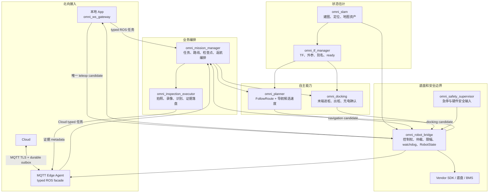
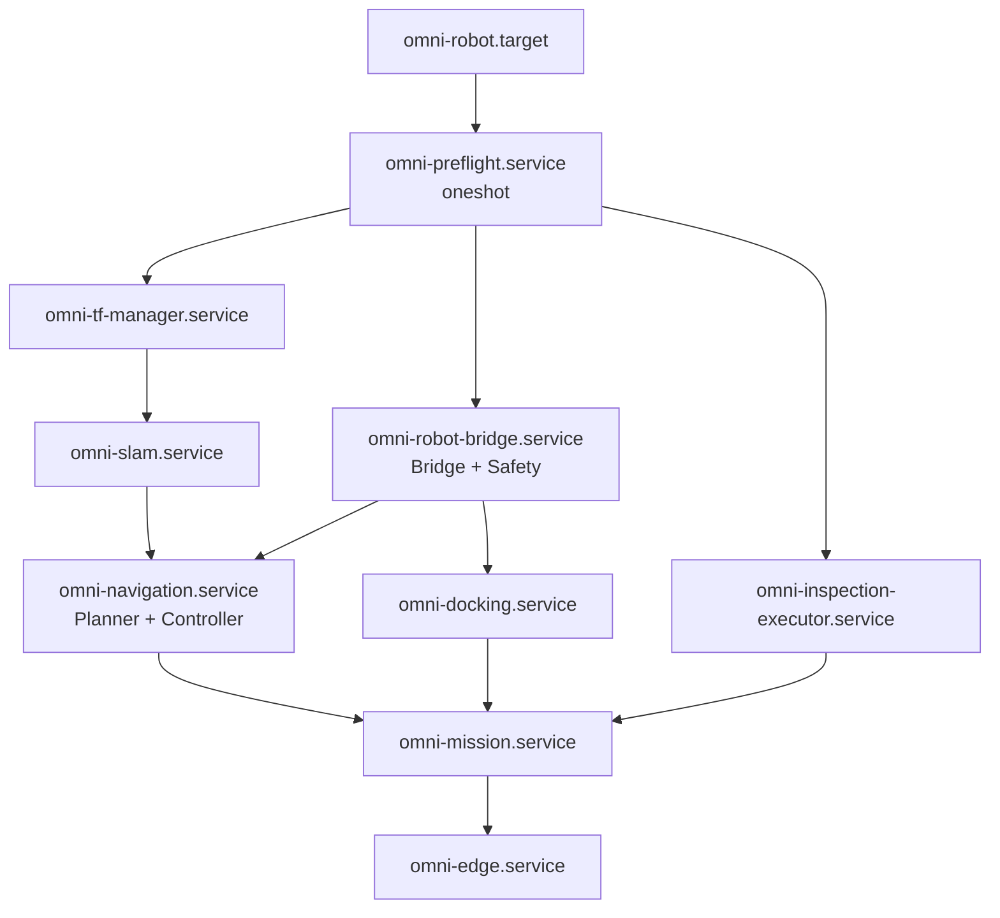
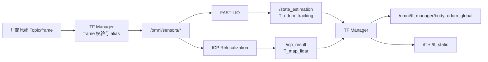
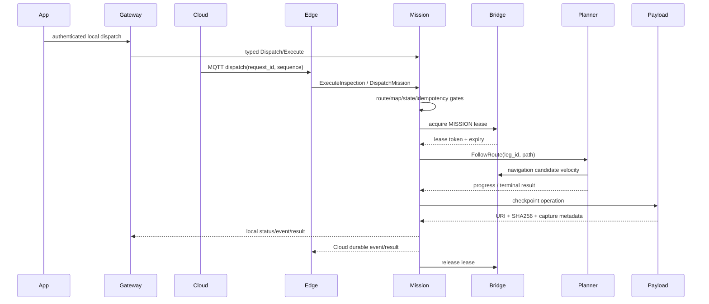
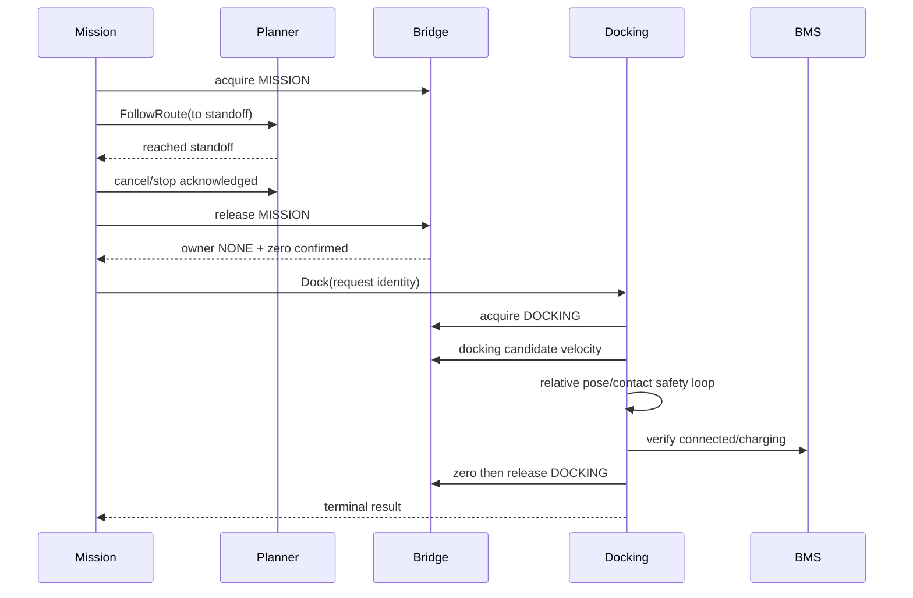
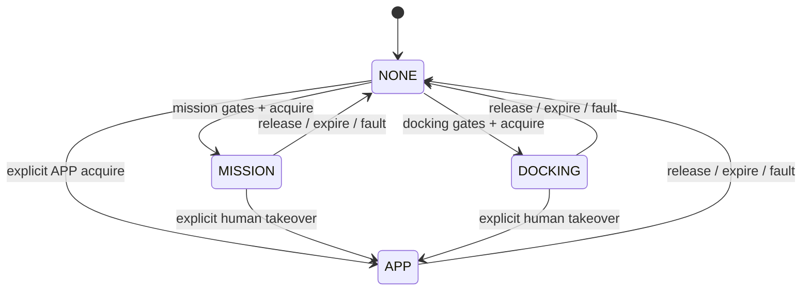

# Omni Navi 机器狗整机运行架构

> 状态：Draft v0.2（架构冻结候选）
> 审计基线：2026-08-25
> 文档修订：2026-08-26
> 适用平台：Matrix/x86、Orin、RDK S100、真实机器狗
> 所有者：`omni_navi` 集成仓库

## 1. 文档目的

本文定义机器狗上电后到完成巡检、返航和回充所需的整机运行边界，重点回答：

- 每个仓库、进程和 ROS 节点负责什么；
- 关键 Topic、Service、Action、TF 和 QoS 由谁提供、由谁消费；
- App、Cloud、Edge Agent 与机器人本地自治之间如何通信；
- 谁可以控制底盘，以及失联、进程退出、定位丢失时如何停车；
- 地图、路线、Dock、标定和软件版本如何绑定；
- 量产前还缺哪些能力，哪些能力应归入现有模块。

本文是目标架构，不代表所有内容已经实现。表格中的“当前偏差”和文末放行门槛用于区分现状与目标。

## 2. 范围和非目标

范围包括机器人本体上运行的：

- 传感器接入、TF、SLAM、Planner、控制器；
- 厂商 SDK Bridge、安全监督、任务管理、自动回充；
- 巡检载荷、边缘接入、整机启动和部署；
- 与 App/Cloud 的受控接口。

本阶段非目标：

- 不重写不在高频运动闭环中的 `omni_slam_manager` Python 控制面；
- 不同时引入第二套导航器、第二套任务管理器或第二套控制权管理器；
- 不为地图、状态、诊断等每项能力单独创建 Manager；
- 不把 Cloud 可用性作为本地安全停车的前提。

## 3. 当前基线结论

当前状态应定义为“核心模块可单独运行，尚未形成可部署整机巡检栈”。主要证据如下：

- `omni_robot_bridge/launch/product_bringup.launch.py` 只启动 Bridge、Safety Supervisor 和可选 OpenNav Docking；
- 当前打包脚本没有统一包含 `omni_slam`、`omni_planner` 和自研 `omni_docking`；
- SLAM、Planner 仍依赖各仓库脚本单独启动，缺少统一 profile、启动顺序和故障域；
- Mission 消费 `/omni/control/authority`，Bridge 尚未提供该 typed service；
- Docking 仍使用 `/rosdeck/control_*` 字符串租约和 `lio_map`；
- Edge Agent 仍可直接发布厂商速度 Topic、调用厂商姿态服务，形成第二控制面；
- S100 Edge 生产配置未显式选择导航 adapter，当前会落到 simulation：机器不动也可能上报 patrol 成功；
- Edge 的 map activate 只缓存 map identity，没有实际调用 SLAM 定位并等待 TF ready；
- Bridge 的当前 RobotState 聚合没有纳入 `SlamStatus.initialized`/freshness，`motion_authorized` 也尚未执行完整定位门控；
- `/omni/capture/photo`、`/omni/capture/record`、`/omni/recognize` 已有接口但没有产品 provider；
- Mission/Docking 的 Python ROS 节点存在会阻断实际 Action 链路的实现错误，详见各自 C++ 重构设计。

## 4. 架构原则和安全不变量

以下规则是实现和评审时不可被参数绕过的约束：

1. `omni_robot_bridge` 是唯一厂商 SDK 所有者。
2. Bridge 是唯一最终速度出口；厂商速度 Topic 只允许 Bridge 发布。
3. Planner、Docking、Teleop 只发布各自的候选速度，不能触达 SDK。
4. Mission Manager 只做业务编排，不发布速度、不计算轨迹、不直接访问厂商接口。
5. `omni_tf_manager` 是 managed TF 边的唯一发布者；SLAM 只输出位姿、对齐结果和状态。
6. 控制权不等于运动许可。即使租约有效，安全、定位、TF 或命令 freshness 不满足时仍必须输出零。
7. 所有状态机、接口和超时默认 fail-closed；未知状态不能解释为 ready。
8. App/Cloud/Edge 的任务和回充请求不得绕过 Mission；任何速度不得绕过 Bridge。Cloud 失联不能导致旧运动命令重放。
9. 资产必须按 `robot_id + map_id + map_version + calibration_version` 绑定，不能只凭文件名推断。
10. 进程存活不等于功能就绪，功能就绪也不等于允许运动。

## 5. 目标逻辑架构



## 6. 仓库、进程和职责

| 仓库 | 目标进程/节点 | 语言 | 唯一职责 | 当前偏差 |
| --- | --- | --- | --- | --- |
| `omni_robot_interfaces` | 无 | ROS IDL | 跨仓产品接口和常量的唯一来源 | SLAM 状态接口仍分散；V1 ABI 冻结不完整 |
| `omni_tf_manager` | `/omni_tf_manager` | C++ | canonical TF、6DoF 外参、传感器 alias、标准 odom、TF ready | Dog/VBot 仍为 shadow；ready 语义需 fail-closed |
| `omni_slam` | `/omni_slam_manager`、`/omni_fast_lio`、`/omni_icp_relocalization` | Python + C++ | 建图、地图存储、定位和 SLAM 状态 | canonical QoS 尚未闭环 |
| `omni_planner` | `/omni_scan_planner`、`/omni_closed_loop_controller` | C++ | FollowRoute、规划、跟踪、navigation 候选速度 | 正式 Topic/ready 默认值和 feature 分支尚未收敛 |
| `omni_robot_bridge` | `/omni_robot_bridge`、`/omni_safety_supervisor` | C++ | 唯一 SDK owner、租约、速度仲裁、安全门、BMS、RobotState | typed authority 缺失；当前节点名仍为 `rosdeck_*` |
| `omni_docking` | `/omni_docking` | 目标 C++ | Dock/Undock、末端感知和控制、接触与充电确认 | 当前 Python 原型不可作为真机基线 |
| `omni_mission_manager` | `/omni_mission_manager` | 目标 C++ | 任务、路线、检查点、持久化、Return-to-Dock 编排 | 当前 Python ROS wiring 有阻断问题 |
| `omni-inspection` | `/omni_inspection_executor`、Edge Agent、视频进程 | C++ + Go + TS | C++ 载荷/Edge、Go backend/video、TS Web；证据和 Cloud 边缘接入 | 载荷 provider 缺失；Edge 仍可直控底盘 |
| `rosdeck` | `/omni_ws_gateway` | Python/TS | 本地 App 接入、认证、协议转换 | ROS 发布白名单需要收紧 |
| `omni_navi` | 无业务节点 | launch/config/systemd | 整机 BOM、profile、preflight、bringup、联合 CI | 目前只有文档和构建清单 |

迁移期允许保留旧 package/executable 名，但目标 ROS 节点名必须以 `omni_` 开头。旧 `/rosdeck/*` 和 `/scan_planner/cmd_vel` 只能作为有期限的兼容入口，不能成为新功能依赖。

## 7. 部署拓扑和故障域

`omni_navi` 内应增加一个纯集成包 `omni_robot_bringup`。它只包含：

- 机器人 profile 选择与参数装配；
- launch、systemd unit/target 和 preflight；
- 版本 BOM、标定 checksum、地图/路线兼容检查；
- 整机 smoke test。

本阶段不新增“System Manager”业务节点。生命周期和业务状态仍由各组件自己提供，OS 级进程监督由 systemd 完成。



这些箭头只表示启动依赖，不表示 readiness。节点可以提前存活，但在前置条件未满足时必须拒绝 Action 或保持零速。

## 8. TF 和传感器契约

### 8.1 Canonical TF 树

```text
omni_map
└── omni_odom
    └── omni_base_link
        ├── omni_imu_link
        │   └── omni_lidar_link
        ├── omni_depth_camera_link
        │   └── omni_depth_camera_optical_frame
        └── omni_rgb_camera_link
            └── omni_rgb_camera_optical_frame
```

| TF 边 | 唯一所有者 | 输入语义 |
| --- | --- | --- |
| `omni_map -> omni_odom` | `omni_tf_manager` | ICP 的 `T_map_lidar` 与已审核静态外参 |
| `omni_odom -> omni_base_link` | `omni_tf_manager` | FAST-LIO 的 `T_odom_tracking` 与 tracking→base 外参 |
| Base、IMU、LiDAR、Camera 固定边 | `omni_tf_manager` profile | 经审核的完整 6DoF 外参 |
| 腿、关节等运动边 | `robot_state_publisher` | URDF/joint state；不得覆盖上述 child |

### 8.2 原始 frame 与 canonical frame

厂商消息可以继续使用 `/front_lidar`、`livox_frame` 等真实 Topic/frame。TF Manager profile 必须同时声明：

- 原始 Topic；
- 预期原始 `header.frame_id`；
- canonical 输出 Topic/frame；
- alias 是否经过真机验证；
- 原始 frame 与 canonical frame 是否物理同一坐标系。

Alias 只允许在“载荷坐标不变、仅名称归一化”时改 `header.frame_id`。如果两坐标系存在旋转或平移，必须对消息做真实坐标变换，不能伪装 alias。

### 8.3 传感器到定位的数据流



## 9. 核心 ROS 接口

所有跨仓产品类型最终应由 `omni_robot_interfaces` 统一所有。V1 临时例外包括 `omni_tf_manager/msg/SlamStatus` 和 `omni_slam_interfaces` 的建图/定位接口；V2 将其迁入产品接口仓，由 SLAM 生产状态和提供操作，TF/Bridge/Mission/Bringup 只消费，TF Manager 永不成为 SLAM API owner。

### 9.1 状态与事件

| 名称 | 类型 | 目标 QoS | 生产者 | 消费者 |
| --- | --- | --- | --- | --- |
| `/omni/robot_state` | `RobotState` | Reliable + Transient Local，depth 1 | Bridge | Mission、Docking、App、Edge |
| `/omni/slam/status` | `SlamStatus` | Reliable + Transient Local，depth 1，周期心跳 | SLAM Manager | TF、Bridge、Mission |
| `/omni/tf_manager/ready` | `Bool` | Reliable + Transient Local，depth 1 | TF Manager | Bridge、Planner、Docking |
| `/omni/mission/status` | `MissionStatus` | Reliable + Transient Local，depth 1 | Mission | Bridge、App、Edge |
| `/omni/mission/events` | `MissionEvent` | Reliable + Volatile，depth ≥ 10 | Mission | Edge、审计 |
| `/omni/mission/checkpoint_results` | `CheckpointResult` | V2 Reliable + Volatile，depth 10；历史走查询 Service | Mission | Edge、App |
| `/omni/docking/status` | `DockStatus` | Reliable + Transient Local，depth 1 | Docking | Mission、App、Edge |
| `/diagnostics` | `DiagnosticArray` | Reliable + Volatile | 各模块 | Edge、运维 |

### 9.2 Action 和 Service

| 名称 | 类型 | Provider | Client |
| --- | --- | --- | --- |
| `/omni/mission/execute` | `ExecuteInspection` | Mission | App/Edge |
| `/omni/mission/return_to_dock` | `ReturnToDock` | Mission | App、低电策略 |
| `/omni/navigation/follow_route` | `FollowRoute` | Planner | Mission |
| `/omni/docking/dock` | `Dock` | Docking | Mission |
| `/omni/docking/undock` | `Undock` | Docking | Mission |
| `/omni/control/authority` | `ControlAuthority` | Bridge | App Gateway、Mission、Docking |
| `/omni/docking/config` | `GetDockConfig` | Docking | Mission |
| `/omni/docking/verify_charge` | `VerifyCharge` | Docking | Mission；maintenance 只读入口可选 |
| `/omni/capture/photo` | `CapturePhoto` | Inspection Executor | Mission |
| `/omni/capture/record` | V1 `StartRecord`；V2 应升级为 Action | Inspection Executor | Mission |
| `/omni/recognize` | `Recognize` | Inspection Executor | Mission |
| `/omni/slam/start_mapping` | V1 `omni_slam_interfaces/srv/StartMapping` | SLAM Manager | 运维/Bringup |
| `/omni/slam/stop_mapping` | V1 `omni_slam_interfaces/srv/StopMapping` | SLAM Manager | 运维/Bringup |
| `/omni/slam/save_map` | V1 `omni_slam_interfaces/action/SaveMap` | SLAM Manager | 运维/Bringup |
| `/omni/slam/start_localization` | V1 `omni_slam_interfaces/action/StartLocalization` | SLAM Manager | Mission/Edge/Bringup |
| `/omni/slam/stop_localization` | V1 `omni_slam_interfaces/srv/StopLocalization` | SLAM Manager | 运维/Bringup |

当前没有实际产品 provider 的 P0 接口为 `/omni/control/authority`；巡检载荷三个 provider 属于形成真实巡检闭环前的 P1。

### 9.3 运动数据面

| Topic | 类型 | 目标 QoS | 唯一生产者 |
| --- | --- | --- | --- |
| `/omni/cmd_vel/teleop` | `TwistStamped` | Best Effort + Volatile，depth 1 | `omni_ws_gateway`；Edge 远程 teleop 当前禁用 |
| `/omni/cmd_vel/navigation` | V2 `TwistStamped` | Best Effort + Volatile，depth 1 | Planner Controller |
| `/omni/cmd_vel/docking` | V2 `TwistStamped` | Best Effort + Volatile，depth 1 | Docking |
| `/omni/cmd_vel/final` | `Twist`，内部接口 | Best Effort + Volatile，depth 1 | Bridge Arbiter |
| `/omni/safety/estop` | `Bool` heartbeat | Reliable + Volatile，depth 1 | Safety Supervisor |

`/scan_planner/cmd_vel` 作为 V1 兼容别名保留一个迁移窗口。所有速度候选必须配置 Bridge receipt-time watchdog；`TwistStamped` 只有 stamp 和 twist，不具有业务 sequence/TTL。时间同步健康时再检查 stamp skew。Preflight/运行时图监控必须确认每个正式候选 Topic 只有一个 publisher。

### 9.4 高频数据 QoS

- LiDAR、IMU、camera、high-rate odom 统一采用 `SensorDataQoS`；
- Writer 为 Best Effort 时，所有 reader 也必须兼容 Best Effort；
- 不能依赖 DDS 实现“自动兼容” Reliable reader 与 Best-Effort writer；
- CI 必须启动真实 publisher/subscriber，检查 endpoint compatibility，而不只检查源码字符串。

## 10. 关键业务流

### 10.1 巡检任务



Mission 的所有持久化状态、事件和幂等记录必须在一个事务中提交。Cloud 重试只允许复用同一 `(request_id, sequence)`，不能重复产生物理动作。

### 10.2 Return-to-Dock



MISSION 与 DOCKING 禁止直接抢占。交接顺序必须是：下游停止确认 → Bridge 零速 → 旧租约 release ack → owner NONE → 新租约 acquire。

### 10.3 人工接管

- App 必须显式申请 APP authority；
- APP 可以抢占自动任务，但 Bridge 必须先输出零再切换 owner；
- Mission/Docking 收到 preempt 后进入可审计 terminal 状态；
- App/WS session 断线时 APP lease 到期，旧命令不得重放；
- Edge/Cloud 断线只关闭 Cloud 命令入口和上报链，不得影响本地 APP lease，也不得恢复已禁用的远程 teleop；
- Edge 不得调用 `/vel_cmd` 或厂商 run-mode 服务，所有姿态/运动请求经过 Bridge typed API。

## 11. 控制权与运动许可

### 11.1 控制权状态



V2 `ControlAuthority` 必须包含或等价表达：owner type、client ID、lease token/epoch、expiry、acquire/renew/release、preemption reason 和 release acknowledgement，避免旧 renew 对新租约产生 ABA 问题。

当前 IDL 文档与 Bridge 实现的 owner 优先级不一致，必须在 W35 冻结为单一合同。远程 Cloud/Edge teleop 不进入本轮接口；当前产品 profile 中 `/omni/cmd_vel/teleop` 只允许 WS Gateway 发布。

### 11.2 运动许可

Bridge 对每个周期计算：

```text
motion_allowed =
  bridge_connected
  && safety_heartbeat_fresh
  && !estop_latched
  && lease_valid
  && source_matches_owner
  && source_command_fresh
  && robot_mode_allows_motion
  && (owner == APP || (tf_ready && localization_ready))
  && (owner != DOCKING || docking_safety_ready)
```

任何输入未知、超时、NaN、frame 不匹配、publisher 数量异常都按 false 处理。

V1 `RobotState.motion_authorized` 还不能表达上述完整真值。W35 的 V2 合同必须加入或等价表达 SLAM `initialized/state/freshness`、TF ready、authority epoch 和 motion-gate reason；Bridge 是最终聚合和发布者，消费者不得重新猜测许可。

### 11.3 `/omni/tf_manager/ready` 正确语义

- shadow 模式的主 `ready` 永远为 false；候选诊断使用不同接口；
- 必须是 authority mode；
- SlamStatus 必须 fresh、`initialized=true` 且 state 属于允许集合；
- 建图允许 `MAPPING/MAP_READY`，定位只允许 `LOCALIZED`；
- `DEGRADED/LOST/STOPPING/ERROR/STOPPED` 必须 false；
- odom、map alignment 和必需传感器必须 fresh；
- mode/state 不匹配或未知枚举必须 false 并上报 ERROR。

## 12. Bringup、Shutdown 和恢复

### 12.1 启动顺序

1. Preflight 验证 robot profile、BOM、标定 checksum、地图资产、ROS Domain、RMW、时间同步、磁盘余量和 SDK singleton。
2. Bridge 与 Safety 启动，保持 E-stop 锁存并向厂商侧持续输出零。
3. TF Manager 加载完整静态树和传感器 alias；未经审核的 profile 不允许 authority。
4. SLAM Manager 启动，初始为 STOPPED。
5. 根据操作选择建图或定位；定位必须得到 fresh、initialized、LOCALIZED。
6. TF Manager 完成 `map -> odom -> base` 并发布 authoritative ready。
7. Planner、Docking 启动；Inspection Executor 校验相机/算法 endpoint、证据目录、磁盘配额和持久化 outbox。
8. Mission 在 Planner、Docking 和任务所需 Payload ready 后接收请求；不满足 gate 时明确拒绝，不能把缺失证据误报为 checkpoint 成功。
9. Edge/App 才开放会引发运动的 API。
10. 操作员显式 arm Safety 并 reset E-stop。

### 12.2 关闭顺序

1. Gateway/Edge 停止接受新的运动和任务请求；
2. Mission 取消活动 Action；
3. Planner/Docking 发布零并确认停止；
4. Inspection Executor 取消活动载荷操作，原子提交或废弃临时文件并 flush durable outbox；
5. Bridge 释放租约、锁存 E-stop，并保持最终零速；
6. 停止 Mission、Docking、Planner、Inspection Executor、SLAM、TF；
7. Bridge 最后退出，调用厂商 stop/passive 策略并释放 SDK lock。

### 12.3 故障处置

| 故障 | 检测 | 必须动作 | 恢复策略 |
| --- | --- | --- | --- |
| Planner/Controller 退出 | cmd/heartbeat timeout | Bridge 零速，Mission 失败或暂停 | 重新定位后新建 goal，不续跑旧轨迹 |
| Docking 退出 | cmd/lease timeout | 零速、租约失效 | 回到 standoff，人工确认后重试 |
| Mission 退出 | lease 过期 | 零速，数据库活动任务标记 INTERRUPTED | 不自动恢复运动 |
| Inspection Executor 退出 | endpoint/heartbeat 或 operation timeout | 活动 checkpoint 明确 FAILED，禁止伪造 artifact/result | 重启后按 operation identity 查询；无新命令不重复采集 |
| SLAM/TF 过期 | status/odom/ready timeout | 撤销 MISSION/DOCKING 运动许可 | 原地重定位；失败则等待人工 |
| Safety heartbeat 消失 | deadline timeout | 立即锁存 E-stop | 恢复后显式 arm + reset |
| App/WS session 断线 | session/lease heartbeat | APP lease 到期，Bridge 零速 | 重连后重新认证和申请新 lease |
| Edge/MQTT 断线 | session/heartbeat | 关闭 Cloud 命令入口/上报；本地自主任务按冻结策略继续或安全暂停 | 重连不重放旧命令，不影响本地 APP lease |
| Bridge 退出 | systemd + 厂商 watchdog | 厂商侧停车，整个安全 epoch 失效 | 重启后仍保持锁存 |
| 资产版本不匹配 | Mission 前置检查 | 拒绝任务 | 选择匹配资产 |
| 数据库/磁盘满 | transaction/space monitor | 拒绝新任务和新证据 | 清理、审计后恢复 |
| 时间同步异常 | chrony/PTP 与 stamp skew | 拒绝远程 stamped 命令 | 同步恢复后重新授权 |

## 13. 地图、路线、Dock、标定和证据资产

所有可持久化资产必须包含 schema version、创建工具版本、hash 和原子更新语义。

| 资产 | 所有者 | 必需身份字段 |
| --- | --- | --- |
| 地图 | SLAM Manager | `map_id`、`map_version`、SHA256、frame、创建时间 |
| 路线 | Mission Manager | route ID、map identity、frame、checkpoint IDs、SHA256 |
| Dock 配置 | Docking | dock ID、map identity、frame、final pose、standoff、schema |
| TF/标定 | TF Manager profile | robot model/serial、calibration version、每个 6DoF、审核状态、SHA256 |
| 巡检证据 | Inspection Executor + Mission | mission/checkpoint/request identity、时间、frame/pose、URI、SHA256、上传状态 |
| 软件 BOM | omni_navi | 每仓 commit SHA、toolchain、平台 ABI、artifact digest、CI evidence |

写入策略必须使用 staging + fsync/校验 + atomic rename；读取时不能把旧 frame 或旧 map 只作为 warning 继续使用。

## 14. 真实巡检所需的最小补充能力

### 14.1 必须新增

1. **`omni_robot_bringup` 集成包**：位于 `omni_navi`，无业务节点，只负责 profile、launch、systemd、preflight、BOM 和整机测试。
2. **`omni_inspection_executor` 单一运行进程**：提供拍照、录像、识别、证据落盘/hash 和离线队列。先作为一个 C++ ROS package 实现，不按相机或算法继续拆节点/仓库。

### 14.2 并入现有模块

| 能力 | 归属 |
| --- | --- |
| GPIO 急停、跌倒、异常倾角、底盘故障、过温 | Safety Supervisor + Bridge |
| Dock 相对定位、接触/红外/视觉标记 | `omni_docking` provider/plugin |
| 悬崖、负障碍、地形安全 | Planner/Perception 安全输入 |
| 环形 rosbag、参数/TF/log 故障快照 | Edge Agent 触发和上传；bringup 配置 |
| 地图/路线/标定同步和回滚 | Edge 传输；各资产所有者校验和激活 |
| 证据断点上传 | Inspection Executor 本地 spool + Edge upload |
| 低电返航策略 | Mission；BMS 数据来自 Bridge |
| 时间同步健康 | Host/preflight + Diagnostics |

### 14.3 后置能力

- OTA A/B、签名、SBOM 和自动回滚；
- 设备证书、SROS2/ROS 图 ACL；
- 多机调度、任务优化和边缘 AI；
- 8/24/72 小时稳定性、故障注入和运营指标自动回传。

当前不新增独立 Control Manager、Robot State Manager、Lifecycle Manager、Map Manager 或第二套 Patrol Executor。

## 15. 平台和发布边界

- x86/Matrix：编译、单元/契约、仿真 E2E、故障注入；
- Orin：原生或受控 sysroot 构建、相机/视频、资源和温度验证；
- S100：交叉编译 + 目标板 smoke/HIL，不能只以“成功生成 tar.gz”代替执行验证；
- 真实机器狗：实际 Topic/header、外参、运动轴、急停、定位丢失、Dock/Undock 循环、长时间运行。

联合版本必须记录所有仓库不可变 SHA、构建镜像/toolchain、平台 ABI、配置/标定 hash、测试 URL 和 artifact checksum。release workflow 不得默认跟随其他仓库的 `main`。

## 16. 当前放行阻断项

以下问题未关闭前，不允许宣称“整机自动巡检可真机运行”：

1. Bridge 实现 typed `/omni/control/authority`，并成为唯一租约状态机；
2. Edge Agent 和 WS Gateway 删除直连厂商服务/最终速度的生产路径；
3. canonical sensor/odom QoS 全链路兼容；
4. TF ready 改为 authority + initialized + valid state + freshness 的 fail-closed 语义；
5. Planner 强制依赖 canonical TF/ready，并收敛到 `/omni/cmd_vel/navigation`；
6. Mission/Docking 完成 C++ 行为重写和节点级 Action 测试；
7. Docking 确定并验证真机末端相对观测、接触和充电证据；
8. Dog/VBot 四传感器 Topic、真实 `header.frame_id` 和完整 6DoF 外参通过真机审核；
9. `omni_robot_bringup` 能以一个 profile 启停完整栈并执行反向安全关闭；
10. Matrix 跑通定位→巡检→返航→回充仿真链，真实机器狗再完成分级 HIL。

## 17. 架构决策记录（待冻结）

| ADR | 决策 | 状态 |
| --- | --- | --- |
| ADR-001 | Bridge 为唯一 SDK owner 和最终速度出口 | Accepted |
| ADR-002 | TF Manager 为 canonical TF 唯一 authority | Accepted |
| ADR-003 | Mission/Docking 同仓单进程 C++ 行为重写，不逐行翻译 | Proposed |
| ADR-004 | `omni_robot_bringup` 只做组合和预检，不新增业务 Manager | Proposed |
| ADR-005 | APP 仅显式抢占；MISSION 与 DOCKING 采用零速确认交接 | Proposed |
| ADR-006 | 真实 Dock 必须具备相对观测 + 接触/充电多证据闭环 | Proposed |
| ADR-007 | 巡检载荷使用单一 Inspection Executor，证据本地先落盘 | Proposed |

这些 Proposed ADR 在 W35 评审后冻结；未冻结项不得在各仓库各自发明不同语义。
